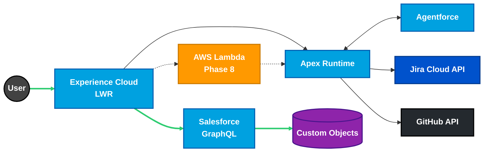

# Ryan Bumstead — Salesforce Platform Architect Portfolio

[](https://rdbumstead.github.io/salesforce-platform-architect-portfolio/)
[](https://github.com/rdbumstead/salesforce-platform-architect-portfolio/actions/workflows/deploy.yml)
[](https://github.com/rdbumstead/salesforce-platform-architect-portfolio/actions/workflows/pr.yml)
[](https://github.com/rdbumstead/salesforce-platform-architect-portfolio/actions/workflows/keep-alive.yml)
[](https://linkedin.com/in/ryanbumstead)
[](https://www.salesforce.com/trailblazer/rbumstead)
[](https://www.salesforce.com/trailblazer/rbumstead)
[](LICENSE)

> [!IMPORTANT]
> **Project Status:** Architecture complete (6 enterprise docs, 26 ADRs) • MVP code in development.
> **Target Launch:** Q1 2026.
> **Contact:** [LinkedIn](https://linkedin.com/in/ryanbumstead) • [ryan@ryanbumstead.com](mailto:ryan@ryanbumstead.com)

**📘 Documentation:** [**View the Governance Hub**](https://rdbumstead.github.io/salesforce-platform-architect-portfolio/) (Rendered Specs, ADRs, & Guides)

**🌐 Live App:** [https://ryanbumstead.com](https://ryanbumstead.com) (Static placeholder until MVP launch)

> [!TIP]
> **Non-Salesforce Reader?** This is a full enterprise-grade system built on the Salesforce CRM platform. It functions as a high-scale public web app with real-time data, AI-generated content, and strict DevOps protocols.

---

## How to Evaluate This Portfolio

### What This Demonstrates

Principal-level Salesforce Platform Architecture including:

- **Multi-Cloud Design** — LWR + AWS Lambda BFF with $0.00-forever architecture.
- **DevOps Maturity** — Delta deployments, automated quality gates, and JWT-based CI/CD.
- **Contract-First APIs** — OpenAPI 3.0 specs proving Salesforce/MuleSoft parity.
- **Applied AI Governance** — Triple-fallback inference pipeline (Agentforce → Gemini → Local).
- **Observability** — Real-time Glass Box telemetry and constraint-aware monitoring.

### Portfolio Overview

**📈 By The Numbers:**

- ✅ **6 Enterprise Documents** — SAS, Charter, Technical Guide, Ops Guide, Governance, Overview.
- ✅ **26 Architectural Decisions (ADRs)** — Documented rationale for performance, security, and AI.
- ✅ **12 Core Competencies** — Mapped to verifiable artifacts and validation methods.
- ✅ **4 Active CI/CD Pipelines** — Delta deploys, PR gates, heartbeat, and worker automation.

**⚡ Quick Navigation:** [Evidence Matrix](#evidence-matrix) • [Architecture Diagram](#north-star-architecture) • [Full Docs](#full-architecture-documentation)

---

## Evidence Matrix

<details>
<summary><strong>📊 Skills-to-Artifacts Evidence Matrix</strong> (Click to expand—maps competencies to verifiable deliverables)</summary>

| Core Competency                 | Demonstrated By                                 | Artifact/Evidence                                                                                                                                                                  | Verification Method                                            |
| :------------------------------ | :---------------------------------------------- | :--------------------------------------------------------------------------------------------------------------------------------------------------------------------------------- | :------------------------------------------------------------- |
| **API Design & Contract-First** | Twin API Pattern with OpenAPI 3.0               | [SAPI Specification](packages/integration-api/specs/salesforce-sapi.yaml) • [ADR-024](docs/adr/024-twin-api-pattern-contract-first-parity.md)                                      | Review OpenAPI schema structure and Apex implementation parity |
| **Enterprise DevOps & CI/CD**   | Delta deployments with quality gates            | [GitHub Actions Workflows](https://github.com/rdbumstead/salesforce-platform-architect-portfolio/actions) • [ADR-006](docs/adr/006-jwt-bearer-flow-for-ci-cd.md)                   | Check pipeline badges and deployment history                   |
| **Multi-Cloud Architecture**    | AWS Lambda BFF + Salesforce LWR hybrid          | [Phase 8 Design](docs/guides/03-SAS.md#appendix-j-cloud-finops-strategy-phase-8---q2-2026) • [ADR-018](docs/adr/018-finops-constraint-aws-lambda-function-urls-vs-api-gateway.md)  | Review FinOps strategy and dual-door pattern                   |
| **AI/ML Governance**            | Triple-fallback inference with circuit breakers | [AI Strategy Section](docs/guides/03-SAS.md#541-feature-spotlight-generative-cover-letter-engine) • [ADR-015](docs/adr/015-strategy-pattern-for-generative-ai.md)                  | Review sequence diagram and failover logic                     |
| **Security Architecture**       | Zero Trust with Guest User restrictions         | [Data Security Matrix](docs/guides/03-SAS.md#46-data-security-matrix) • [ADR-012](docs/adr/012-guest-user-security-restriction-rules.md)                                           | Examine FLS configuration and API key validation               |
| **Resilience Engineering**      | Circuit breaker pattern with degraded mode      | [Contingency Plans](docs/guides/03-SAS.md#8-contingency--rollback-plans) • [ADR-022](docs/adr/022-resilience-engineering-resilience-simulation-toggle.md)                          | Test resilience simulation toggle (live Q1 2026)               |
| **Performance Optimization**    | Mobile-first with measured LCP targets          | [NFRs Section](docs/guides/03-SAS.md#21-core-nfrs) • [ADR-020](docs/adr/020-mobile-performance-static-svg-fallback-strategy.md)                                                    | Review Lighthouse CI results in Actions                        |
| **Data Modeling**               | Persona-based resume generation schema          | [ERD Diagram](docs/guides/03-SAS.md#41-logical-data-model-simplified-erd) • [Data Dictionary](docs/guides/03-SAS.md#appendix-d-data-dictionary-detailed-schema)                    | Examine junction object strategy and filtering logic           |
| **Cloud FinOps**                | $0.00 forever architecture                      | [FinOps Appendix](docs/guides/03-SAS.md#appendix-j-cloud-finops-strategy-phase-8---q2-2026) • [ADR-018](docs/adr/018-finops-constraint-aws-lambda-function-urls-vs-api-gateway.md) | Verify Always-Free tier governance model                       |
| **Observability & Monitoring**  | Real-time telemetry with Glass Box pattern      | [Observability Section](docs/guides/03-SAS.md#9-observability--glass-box-telemetry) • [ADR-014](docs/adr/014-deferred-telemetry-loading-performance.md)                            | View Glass Box footer demo (live Q1 2026)                      |
| **Integration Patterns**        | Server-side caching for external APIs           | [GitHub Integration](docs/guides/03-SAS.md#appendix-a-engineering-implementation-notes) • [ADR-007](docs/adr/007-github-api-server-side-caching.md)                                | Review Named Credential configuration                          |
| **Technical Documentation**     | Enterprise-grade architecture suite             | [6 Architecture Guides](#full-architecture-documentation) • [SAS](docs/guides/03-SAS.md)                                                                                           | Review documentation structure and C4 model diagrams           |

</details>

---

### Verification Checklist for Evaluators

**✅ Available Now:**

- [Architecture decisions documented with rationale](docs/adr/) — 26 ADRs covering performance, security, AI, FinOps
- [CI/CD pipelines green with delta deployment strategy](https://github.com/rdbumstead/salesforce-platform-architect-portfolio/actions) — 4 active workflows (deploy, PR validation, heartbeat, worker)
- [API contracts OpenAPI 3.0 compliant](packages/integration-api/specs/salesforce-sapi.yaml) — Twin API pattern with SAPI + PAPI specifications
- [Multi-cloud design cost-optimized](docs/guides/03-SAS.md#appendix-j-cloud-finops-strategy-phase-8---q2-2026) — $0.00 forever architecture using AWS Always-Free tier
- [Mobile performance targets quantified](docs/guides/03-SAS.md#21-core-nfrs) — LCP < 2.5s with static SVG fallback strategy
- [Zero Trust security model enforced](docs/guides/03-SAS.md#46-data-security-matrix) — Guest user FLS restrictions + API key validation + read-only endpoints
- [AI governance with failover strategy](docs/guides/03-SAS.md#541-feature-spotlight-generative-cover-letter-engine) — Triple-fallback inference stack with circuit breakers

**🚧 Available at MVP Launch (Q1 2026):**

- **Real-time observability** — Glass Box footer showing live Salesforce governor limits (Heap, CPU, SOQL) and AI provider health
- **Resilience simulation** — Toggle switch to force GitHub/Jira integration failures and observe circuit breaker behavior with cached fallbacks
- **Interactive API testing** — Built-in developer console to call REST endpoints, compare against OpenAPI spec, verify `X-Request-Id` headers
- **Mobile performance validation** — View on mobile devices to trigger static SVG fallback and validate LCP < 2.5s target

---

## Interactive Demonstrations (Live Q1 2026)

> [!NOTE]
> Detailed preview of items from the "Available at Launch" section above. The live site is currently under development.

**Resilience Engineering**

- Toggle "Resilience Simulation" in the Glass Box footer to force GitHub/Jira integration failures
- Watch the system serve cached data gracefully with circuit breaker status indicators (Open/Closed/Half-Open)
- Validates enterprise high-availability patterns under controlled failure conditions

**API-First Architecture**

- Use the built-in API Tester component to call native Salesforce REST endpoints
- Compare live responses against the OpenAPI specification in real-time
- Verify mandatory distributed tracing headers (`X-Request-Id`) and proper error response formats

**Production Observability**

- Monitor real-time Salesforce governor limits (Heap, CPU, SOQL queries) in the Glass Box footer
- Track AI provider health and automatic failover status across the triple-fallback stack
- Demonstrates constraint-aware development practices and platform limit management

**Mobile-First Performance**

- View the site on mobile devices to automatically trigger static SVG fallback for the skill graph
- Validates performance budgeting (LCP < 2.5s) and WCAG 2.1 AA accessibility compliance
- Proves responsive design with graceful degradation strategies

---

## Phase 8: Multi-Cloud Extension (Design Complete for Q2 2026)

**AWS Lambda Polyglot BFF (Door 2 Architecture)**

- **85% payload reduction** vs. parallel REST calls through intelligent server-side orchestration
- **$0.00 forever guarantee** — Strict governance using AWS Always-Free tier (Lambda Function URLs, no API Gateway)
- **Serverless resume engine** — Node.js Lambda for perfect PDF fidelity, replacing client-side jsPDF implementation
- **Enterprise API gateway** — Full rate limiting, API key management, and distributed tracing outside Salesforce governor limits

---

## Architectural Decision Records

<details>
<summary><strong>📋 Architectural Decision Records (ADR) Index</strong> (Click to expand—26 documented decisions)</summary>

| ID                                                                                       | Subject                             | Strategic Driver         |
| :--------------------------------------------------------------------------------------- | :---------------------------------- | :----------------------- |
| [ADR-001](docs/adr/001-experience-cloud-lwr-vs-aura.md)                                  | Experience Cloud (LWR) vs. Aura     | Performance (LCP < 2.5s) |
| [ADR-002](docs/adr/002-custom-objects-vs-standard-objects.md)                            | Custom Objects vs. Standard Objects | Security / Guest Access  |
| [ADR-003](docs/adr/003-apex-rest-vs-external-service.md)                                 | Apex REST vs. External Service      | Budget / FinOps          |
| [ADR-004](docs/adr/004-static-resource-code-rendering.md)                                | Static Resource Code Rendering      | Rate Limiting            |
| [ADR-005](docs/adr/005-gamified-testimonial-ui.md)                                       | Gamified Testimonial UI             | User Engagement          |
| [ADR-006](docs/adr/006-jwt-bearer-flow-for-ci-cd.md)                                     | JWT Bearer Flow for CI/CD           | DevOps Automation        |
| [ADR-007](docs/adr/007-github-api-server-side-caching.md)                                | GitHub API Server-Side Caching      | Resilience               |
| [ADR-008](docs/adr/008-jira-integration-vs-agile-accelerator.md)                         | Jira Integration vs. Accelerator    | ALM Maturity             |
| [ADR-009](docs/adr/009-granular-resume-data-model.md)                                    | Granular Resume Data Model          | Persona-Based Filtering  |
| [ADR-010](docs/adr/010-visualization-engine-vis-js-vs-antv-g6.md)                        | Vis.js vs. AntV G6                  | UI/UX Animation          |
| [ADR-011](docs/adr/011-context-grounding-strategy-direct-crm-vs-data-360.md)             | Direct CRM vs. Data 360 Grounding   | AI Architecture          |
| [ADR-012](docs/adr/012-guest-user-security-restriction-rules.md)                         | Guest User Restriction Rules        | Zero Trust Security      |
| [ADR-013](docs/adr/013-structured-logging-framework-nebula-logger.md)                    | Nebula Logger Implementation        | Observability            |
| [ADR-014](docs/adr/014-deferred-telemetry-loading-performance.md)                        | Deferred Telemetry Loading          | Performance              |
| [ADR-015](docs/adr/015-strategy-pattern-for-generative-ai.md)                            | Strategy Pattern for Generative AI  | High Availability        |
| [ADR-016](docs/adr/016-cloudflare-worker-as-edge-ai-proxy.md)                            | Cloudflare Worker as AI Proxy       | Multi-Cloud Scaling      |
| [ADR-017](docs/adr/017-system-api-security-and-dual-sided-auth-pattern.md)               | API Security & Method Constraints   | Security Governance      |
| [ADR-018](docs/adr/018-finops-constraint-aws-lambda-function-urls-vs-api-gateway.md)     | AWS Lambda URLs vs. API Gateway     | FinOps / Cost Control    |
| [ADR-019](docs/adr/019-executable-governance-platform-events-for-documentation-logic.md) | Platform Events for Documentation   | Executable Governance    |
| [ADR-020](docs/adr/020-mobile-performance-static-svg-fallback-strategy.md)               | Mobile Static SVG Fallback          | Performance              |
| [ADR-021](docs/adr/021-native-graphql-door-1-vs-apex-rest-for-ui.md)                     | Native GraphQL vs. Apex REST        | Frontend Orchestration   |
| [ADR-022](docs/adr/022-resilience-engineering-resilience-simulation-toggle.md)           | Resilience Simulation Toggle        | Trust / Resilience       |
| [ADR-023](docs/adr/023-client-side-pdf-generation-jspdf-for-mvp.md)                      | Client-Side PDF Generation (jsPDF)  | Tooling / MVP Speed      |
| [ADR-024](docs/adr/024-twin-api-pattern-contract-first-parity.md)                        | Twin API Pattern                    | Contract Parity          |
| [ADR-025](docs/adr/025-papi-fan-out-throttling-capacity-planning.md)                     | PAPI Fan-Out Throttling             | Capacity Planning        |
| [ADR-026](docs/adr/026-header-based-api-versioning-strategy.md)                          | Header-Based API Versioning         | Versioning Strategy      |

</details>

---

<details>
<summary><strong>📖 Glossary of Terms</strong> (Click to expand)</summary>

| Term          | Meaning                                                                                                                   | Status                        |
| :------------ | :------------------------------------------------------------------------------------------------------------------------ | :---------------------------- |
| **LWR**       | Lightning Web Runtime — Modern Salesforce frontend framework                                                              | Live at MVP                   |
| **ADR**       | **Architectural Decision Record**. A short document explaining a significant decision. **Status:** Complete (26 records). |
| **Dual-Door** | Native Salesforce + External API gateway strategy                                                                         | Door 1: MVP / Door 2: Phase 8 |
| **FinOps**    | Financial Operations — Cloud cost governance and optimization                                                             | Design complete for Phase 8   |
| **Glass Box** | Real-time system telemetry and observability UI pattern                                                                   | Live at MVP                   |
| **RAG**       | Retrieval-Augmented Generation — AI grounding technique                                                                   | Live at MVP                   |
| **BFF**       | Backend For Frontend — Tailored API layer for UI optimization                                                             | Design complete for Phase 8   |
| **SAPI**      | System API — Direct data access layer (API-led connectivity)                                                              | Live at MVP                   |
| **PAPI**      | Process API — Orchestration layer (API-led connectivity)                                                                  | Live at MVP                   |

</details>

---

## North-Star Architecture



> **Diagram Description (for accessibility):** The diagram shows a user connecting to an Experience Cloud LWR site, which routes data requests through either a native Salesforce GraphQL API (Door 1, live in Q1 2026) or an AWS Lambda Polyglot Backend For Frontend (Door 2, design complete for Q2 2026). The Apex Runtime handles integrations with Jira, GitHub, and Agentforce AI, all backed by custom Salesforce objects.

---

## Full Architecture Documentation

> [!TIP]
> **View these documents in the [Governance Hub](https://rdbumstead.github.io/salesforce-platform-architect-portfolio/) for the best reading experience.**

| Document                                      | Link                                                                     |
| :-------------------------------------------- | :----------------------------------------------------------------------- |
| 01 – Executive Overview                       | [Read in Repo →](docs/guides/01-Executive-Overview.md)                   |
| 02 – Program Charter & Roadmap                | [Read in Repo →](docs/guides/02-Program-Charter.md)                      |
| 03 – Systems Architecture Specification (SAS) | [Read in Repo →](docs/guides/03-SAS.md)                                  |
| 04 – Technical Implementation Guide           | [Read in Repo →](docs/guides/04-Technical-Guide.md)                      |
| 05 – Maintenance & Operations Guide           | [Read in Repo →](docs/guides/05-Maintenance-Guide.md)                    |
| 06 – Guardrails & Executable Governance       | [Read in Repo →](docs/guides/06-Guardrails-and-Executable-Governance.md) |

> **For Non-Salesforce Readers:** Document 06 includes plain-English explanations of Salesforce governor limits, AWS cost optimization patterns, and constraint-based design principles. No prior platform knowledge required.

---

## API & Integration Contracts (Contract-First Design)

> [!NOTE]
> This project utilizes a **Twin API Pattern** ([ADR-024](docs/adr/024-twin-api-pattern-contract-first-parity.md)). System and Process APIs are designated to strict OpenAPI 3.0 specifications to ensure technical parity between Salesforce and enterprise middleware.
>
> **Strategy:** In the MVP, orchestration is handled by Salesforce Apex (Door 1). Phase 8 enables Door 2, delegating to **AWS Lambda** for 85%+ payload reduction.
>
> **Security:** All APIs enforce a two-layer auth model ([ADR-017](docs/adr/017-system-api-security-and-dual-sided-auth-pattern.md)) featuring explicit API Key headers and internal OAuth2 Client Credentials.

| Spec                | Role                            | Standard    | Link                                                  |
| :------------------ | :------------------------------ | :---------- | :---------------------------------------------------- |
| **Experience PAPI** | **Process API** (Client-Facing) | OpenAPI 3.0 | [View Spec (YAML)](docs/api/oas/portfolio-papi.yaml)  |
| **Salesforce SAPI** | **System API** (Data Access)    | OpenAPI 3.0 | [View Spec (YAML)](docs/api/oas/salesforce-sapi.yaml) |

---

## Repo Structure

```
├── packages/               # Multi-package monorepo (LWR, Apex Services, GraphQL)
├── docs/guides/            # Full enterprise documentation set
├── scripts/                # CI/CD utility scripts
├── .github/workflows/      # PR validation + delta deploy pipelines
└── config/                 # Linting, formatting, DevOps configs
```

> Repo is source-driven: no build artifacts, only clean source and configs.

---

**Owner:** Ryan Bumstead | **License:** MIT

_Delivered with enterprise rigor. Designed for real scale._
