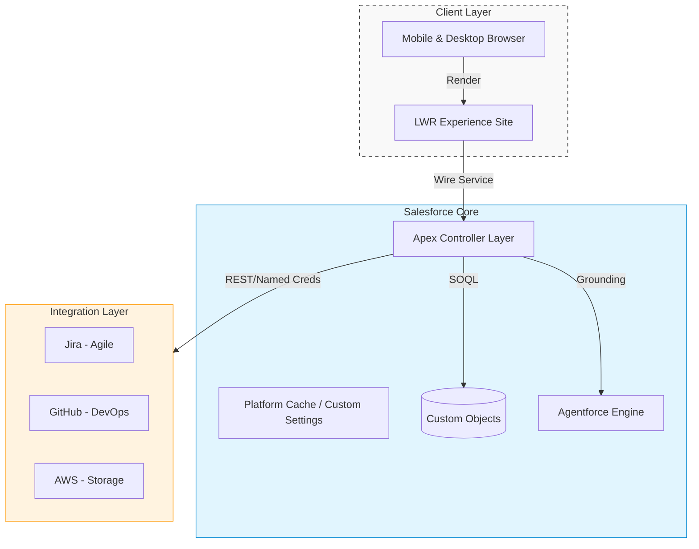

# Salesforce Platform Architect Portfolio

## Executive Summary

This repository contains the source code for the Salesforce Platform Architect Portfolio, a public-facing demonstration of enterprise-grade architecture. Unlike standard portfolios, this system mimics a complex production environment to demonstrate capabilities in API design, LWC, AI (Agentforce), and DevOps discipline.

**Live Site:** [RyanBumstead.com](https://rbumstead-dev-ed.develop.my.site.com/portfolio/) 🔗

---

## Architecture at a Glance

The system is built on the **Lightning Web Runtime (LWR)** for sub-second performance and utilizes a "monorepo" structure with unlocked packages.



---

## Key Technologies

- **Frontend:** Lightning Web Runtime (LWR), LWC, AntV G6 (Graph Visualization)
- **Backend:** Apex REST API (Twin Pattern), Agentforce (AI Grounding)
- **Integration:** Named Credentials (JWT/Basic), GitHub API, Jira API
- **DevOps:** GitHub Actions, sfdx-git-delta, PMD Static Analysis

---

## Git Strategy & CI/CD

This project utilizes a **Delta Deployment** strategy to ensure efficiency and speed. We do not deploy the entire repo on every push; we only deploy what has changed.

### The Pipelines

We utilize two primary workflows triggered by GitHub Events:

| Workflow | Trigger | Description |
|----------|---------|-------------|
| `pr.yml` | Pull Request | **Validation Gate.** Runs LWC Jest tests, PMD Static Analysis, and a "Dry Run" deployment of only the changed metadata against Production to verify validity and test coverage. |
| `deploy.yml` | Push to `main` | **Production Deploy.** Generates a delta package of the changes (diff) and deploys strictly those components to the org. |

### The "Fail Fast" Philosophy

1. **LWC Tests:** Run first via npm to catch JavaScript errors immediately
2. **Static Analysis:** `sf code-analyzer` scans for security/style violations
3. **Delta Generation:** `sfdx-git-delta` calculates the difference between the commit and target
4. **Validation:** The Delta package is validated against the Org

---

## Local Development Setup

### Prerequisites

- Salesforce CLI (`npm install @salesforce/cli --global`)
- Node.js v18+
- Java (for PMD Scanner)

### Installation

**1. Clone the Repo:**
```bash
git clone https://github.com/YourUsername/portfolio-architect.git
cd portfolio-architect
```

**2. Install Dependencies:**
```bash
npm install
echo y | sf plugins install sfdx-git-delta
sf plugins install code-analyzer
```

**3. Authorize Your Org:**
```bash
sf org login web --alias portfolio --instance-url https://login.salesforce.com
```

**4. Run LWC Tests:**
```bash
npm run test:unit
```

---

## Modules & Structure

The repository follows a strict modular package structure (Monorepo). Note that the standard `force-app` folder is not used to enforce separation of concerns.

- **`packages/shared-modules`**: Reusable UI components (Hero Banner, Footer, Utility Classes)
- **`packages/integration-api`**: SAPI implementation, Mock classes, and Named Credentials
- **`packages/employer-hub-demo`**: Metadata specific to Pillar A (Business Architecture)
- **`packages/portfolio-site`**: LWR specific themes, routes, and site configuration

---

## Security & Governance

### Authentication
CI/CD uses **JWT Bearer Flow** (Headless)

### Secret Management
Keys are stored in GitHub Secrets; Certificates rotated annually

### Quality Gates
- Apex Coverage > 75% (Plan: 90%)
- Zero Critical PMD Violations
- LCP < 2.5s (Lighthouse)

---

## 📄 License & Owner

**Owner:** Ryan Bumstead  
**License:** MIT
