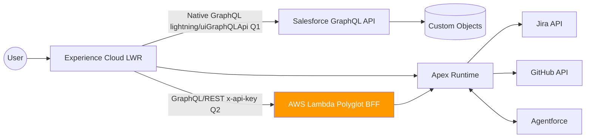

# Ryan Bumstead — Salesforce Platform Architect Portfolio

[](https://github.com/rdbumstead/salesforce-platform-architect-portfolio/actions/workflows/deploy.yml)
[](https://github.com/rdbumstead/salesforce-platform-architect-portfolio/actions/workflows/pr.yml)

**Live Site** → [https://ryanbumstead.com](https://ryanbumstead.com)  
**Full MVP Launch** → Q1 2026  
**Phase 8 Multi-Cloud** → Q2 2026

> All architecture documentation is complete.  
> MVP implementation began December 2025 and ships Q1 2026.

---

## What This Portfolio Demonstrates (for Hiring Managers)

This project showcases Principal-level Salesforce Platform Architecture:

- **End-to-end multi-cloud systems design** (LWR + $0.00-forever Lambda BFF)
- **Enterprise DevOps** (delta deploys, quality gates, scratch org automation)
- **API-first architecture** (OpenAPI spec + Twin API pattern)
- **Applied AI governance** (triple-fallback inference, grounding strategy, safety envelopes)
- **Full enterprise documentation suite** (SAS, Charter, Technical Guide, Ops Guide)

---

## Status at a Glance

| Item               | Status             | Notes                            |
| :----------------- | :----------------- | :------------------------------- |
| Architecture Docs  | ✅ Complete        | 5 full enterprise guides         |
| CI/CD Pipelines    | ✅ Active          | Delta deploys + PMD + coverage   |
| MVP Code           | 🚧 In Development  | Launching Q1 2026                |
| Phase 8 Lambda BFF | 📋 Design Complete | $0.00 forever — fully documented |

---

## Core Features (Enterprise-Grade)

- **Triple-fallback AI inference pipeline** (Agentforce → Gemini → deterministic local model)
- **Native Salesforce GraphQL skill network** (lightning/uiGraphQLApi)
- **Twin API pattern** with full OpenAPI 3.0 specification
- **Real-time Glass Box telemetry** (governor limits in footer)
- **Delta deployments** via sfdx-git-delta + GitHub Actions
- **$0.00 forever multi-cloud BFF** (Phase 8 — fully designed)

---

## North-Star Architecture



---

## Full Architecture Documentation

| Document                                      | Link                                           |
| :-------------------------------------------- | :--------------------------------------------- |
| 01 – Executive Overview                       | [Read →](docs/guides/01-Executive-Overview.md) |
| 02 – Program Charter & Roadmap                | [Read →](docs/guides/02-Program-Charter.md)    |
| 03 – Systems Architecture Specification (SAS) | [Read →](docs/guides/03-SAS.md)                |
| 04 – Technical Implementation Guide           | [Read →](docs/guides/04-Technical-Guide.md)    |
| 05 – Maintenance & Operations Guide           | [Read →](docs/guides/05-Maintenance-Guide.md)  |

---

## Repo Structure

```
├── packages/               # Multi-package monorepo (LWR, Apex Services, GraphQL)
├── docs/guides/            # Full enterprise documentation set
├── scripts/                # CI/CD utility scripts
├── .github/workflows/      # PR validation + delta deploy pipelines
└── config/                 # Linting, formatting, DevOps configs

# Repo is source-driven: no build artifacts, only clean source and configs.
```

---

**Owner:** Ryan Bumstead | **License:** MIT

_Delivered with enterprise rigor. Designed for real scale._
