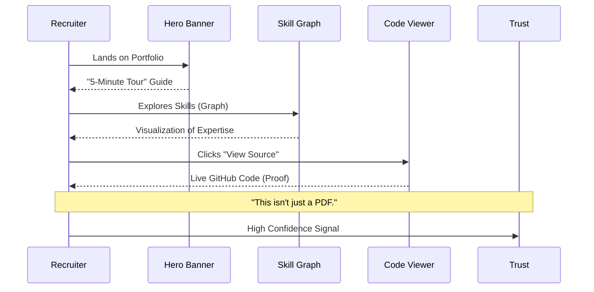

# Executive Overview

**Table of Contents**

- [1. Strategic Summary (Read This First)](#1-strategic-summary-read-this-first)
- [2. Strategic Intent](#2-strategic-intent)
- [3. Business Value: Why Build This Complexity?](#3-business-value-why-build-this-complexity)
  - [3.1 The "5-Minute Tour" User Journey](#31-the-5-minute-tour-user-journey)
- [4. Terminology & Acronyms](#4-terminology--acronyms)
- [5. Success Criteria (Definition of Done)](#5-success-criteria-definition-of-done)

---

Project: Salesforce Platform Architect Portfolio

Version: 1.0

Owner: Ryan Bumstead

Date: MVP – Q1 2026

## 1. Strategic Summary (Read This First)

**The Problem:** Enterprise Salesforce implementations often fail due to three silent killers: uncontrolled costs (FinOps), slow performance (LCP > 4s), and fragile security (Guest User leaks).

**The Solution:** This portfolio demonstrates a **Zero-Cost, High-Scale Architecture**. It proves you can build an enterprise-grade, secure, and observable system entirely within the constraints of the Salesforce Free Tier.

**Why It Matters:**

- **For CTOs:** It proves we can respect budget constraints without sacrificing capability.
- **For Architects:** It demonstrates "Glass Box Telemetry" — showing exactly how the system behaves under load.
- **For Recruiters:** It is a living proof-of-work that loads in < 2.5 seconds.

If you only inspect one thing, look at the **[Systems Architecture Specification (SAS)](./03-SAS.md)** to see the "North Star" diagram.

## 2. Strategic Intent

This Executive Overview defines the strategic intent and delivery plan for the Salesforce Platform Architect Portfolio. It serves as the authoritative entry point for project scope, business value, and timeline.

## 3. Business Value: Why Build This Complexity?

The primary problem this portfolio solves is that Recruiters and Hiring Managers struggle to verify an architect's hands-on skills through static PDFs.

- **The Need:** A verified, interactive demonstration of complex capabilities like API design, LWC, and AI.
- **The Value:** This system intentionally mirrors a real enterprise architecture so evaluators can see architecture quality, integration patterns, DevOps discipline, and multi-cloud strategy — all within a controlled, demonstrable environment. It proves that "Enterprise Grade" is a mindset, not just a license tier.

### 3.1 The "5-Minute Tour" User Journey

How a recruiter or architect experiences this portfolio:

## 4. Terminology & Acronyms

To clarify Salesforce-specific terms used throughout this portfolio:

| Term                  | Definition                                                                                                       |
| :-------------------- | :--------------------------------------------------------------------------------------------------------------- |
| **LWR**               | **Lightning Web Runtime**. A high-performance, standards-based framework for building fast Salesforce sites.     |
| **SAPI**              | **System API**. The interface that directly touches the database/backend (Salesforce Core).                      |
| **PAPI**              | **Process API**. The integration layer that orchestrates logic across systems (e.g., Calling SAPI + Agentforce). |
| **FORM_FACTOR**       | A Salesforce constant that automatically detects the user's device type (Large, Medium, Small).                  |
| **Developer Edition** | The free, zero-cost Salesforce environment used to host this portfolio.                                          |

## 5. Success Criteria (Definition of Done)

This project adheres to strict functional and technical acceptance criteria, including Performance (LCP < 2.5s) and Code Quality (Apex Coverage > 90%).

For the authoritative definition of all success metrics, quality gates, and "Definition of Done", please refer to the **[Program Charter: Success Criteria](./02-Program-Charter.md#22-success-criteria-definition-of-done)**.
