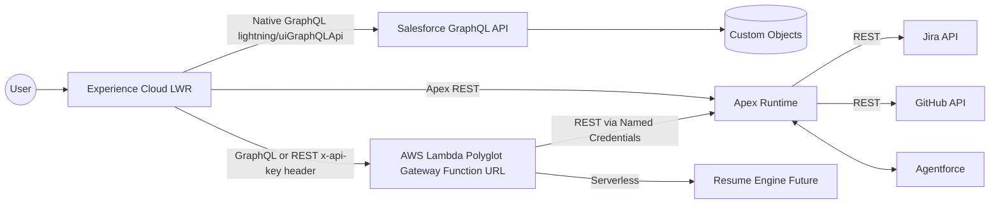
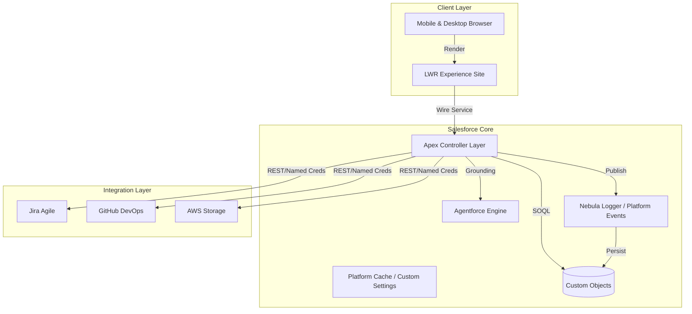
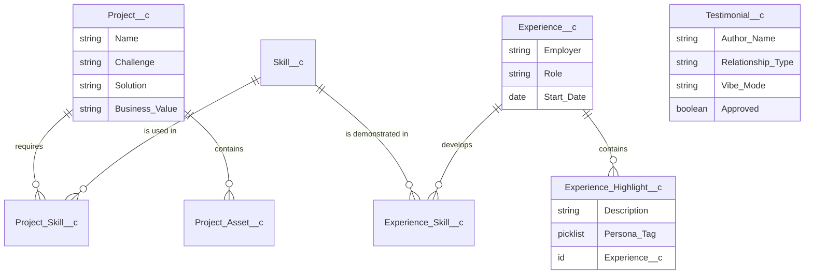
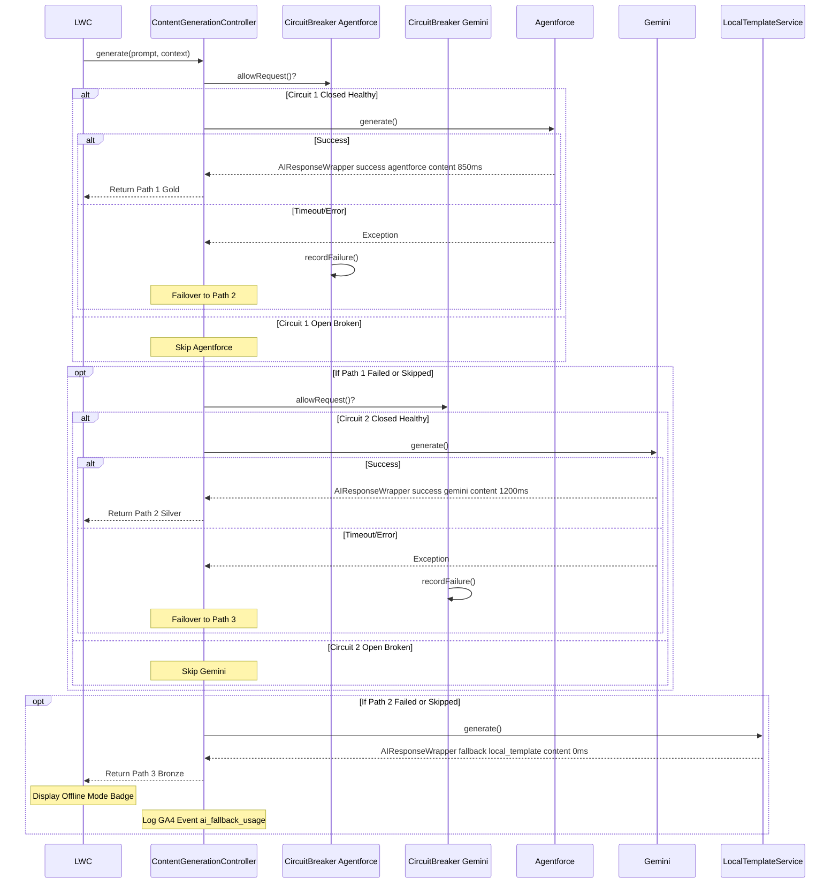

# **Systems Architecture Specification (SAS)**

Project: Salesforce Platform Architect Portfolio

Version: 1.0

Owner: Ryan Bumstead

Date: MVP — Q1 2026

## **1. System Context & Architecture**

### **1.1 Architectural "North Star"**

The high-level data flow demonstrating the multi-cloud, API-led
strategy.

Architecture Implementation Status (MVP — Q1 2026 Launch)

Live MVP (Door 1)

- Native Salesforce GraphQL via lightning/uiGraphQLApi wire adapter

- Apex REST services

- Direct integrations (GitHub, Jira via Named Credentials)

Phase 8 — Q2 2026 (Design Complete)

- AWS Lambda Polyglot Gateway (Function URL) — "Door 2"

- Enterprise API governance layer

- Resume Engine offload

### **1.2 Architecture at a Glance**

10-second overview for executive stakeholders.

### **1.3 Key Salesforce Features Used**

- **Experience Cloud (LWR):** High-performance, pixel-perfect frontend.

- **Apex REST Services:** Custom API layer for external integrations.

- **Custom Metadata Types:** Configuration management.

- **Agentforce:** AI grounding and conversational interface.

- **Unlocked Packages:** Modular deployment strategy.

#### **1.3.1 Technology Selection Rationale**

Why specific technologies were chosen over alternatives.

| Requirement             | Finalist Options      | Selected    | Rejection Reason                                                     |
| :---------------------- | :-------------------- | :---------- | :------------------------------------------------------------------- |
| **Frontend Framework**  | Aura vs. LWR          | **LWR**     | Aura's 3-5s LCP violates UX requirements for public sites.           |
| **Graph Visualization** | Vis.js vs. G6         | **AntV G6** | Vis.js lacks native animation API for flow lines ("running edge").   |
| **API Documentation**   | Swagger UI vs. Redoc  | **Redoc**   | Redoc's single-file static HTML works without Node.js server.        |
| **CI/CD Auth**          | Username/Pass vs. JWT | **JWT**     | Username/Password is fragile and requires rotation; JWT is headless. |

### **1.4 Visual Architecture Standard (C4 Model)**

All architectural artifacts adhere to the C4 Model (Context, Containers,
Components, Code) standard to ensure clarity across abstraction levels.

- **Level 1 (Context):** Defines system boundaries and interactions
  (Recruiters, GitHub, Jira, Calendly).

- **Level 2 (Container):** Illustrates high-level technical building
  blocks (LWR, Apex Runtime, Data Layer, AI Agent).

- **Level 3 (Component):** Details LWC composition and event-driven
  interactions.

- **Level 4 (Deployment):** Infrastructure view (See Appendix H).

### **1.5 Quality Gates (Technical Acceptance)**

The SAS enforces:

- **LCP \< 2.5s** (Monitored via Lighthouse CI in GitHub Actions).

- **Apex Coverage \> 75%** (Enforced via sfdx force:apex:test:run
  \—codecoverage).

- **Zero PMD Critical Violations** (Enforced via sfdx scanner:run in PR
  checks).

- **Reference:** See **Program Charter Section 2.2** for complete
  success criteria.

## **2. Non-Functional Requirements (NFRs)**

This architecture prioritizes performance, security, and resilience
within the constraints of a Developer Edition environment.

### **2.1 Core NFRs**

- **Availability:** Organization persistence maintained via external
  CI/CD "Keep-Alive" heartbeat (GitHub Actions).

- **Maintainability:** Codebase governed by automated quality gates
  (Prettier/PMD) ensuring architectural standards.

- **Performance:** Target LCP \< 2.5s via Static Resource caching and
  minimal DOM footprint.
  - **Latency:** LCP \< 2.5s on 4G networks.

  - **AI Generation Timeout:** 2000ms HTTP timeout (Hard Stop) + 500ms
    buffer for Apex processing.

  - **Total CPU Budget:** \< 5000ms per request (Allocating 50% of the
    10,000ms Synchronous Limit to ensure headroom for platform
    overhead).

- **Security:** Public access restricted strictly to custom objects. No
  PII stored.

- **Scalability:** Data model supports 10,000+ records via indexed
  Junction Objects.

### **2.2 Platform Constraints (Developer Edition)**

The architecture is designed to operate within the specific limits of
the Salesforce Developer Edition.

- **Storage Limits:** 5MB Data Storage / 20MB File Storage limit
  requires strict data hygiene and off-platform storage strategies (AWS
  S3) for artifacts.

- **API Limits:** 15,000 API requests/24hr requires caching strategies
  for high-traffic external integrations.

- **Guest User:** Strict security policies prevent direct standard
  object access, necessitating a custom schema.

- **No Shield:** Lack of Event Monitoring requires custom telemetry
  implementation for analytics.

- **Middleware Constraints:** Heroku and paid AWS resources are
  unavailable. Architecture utilizes AWS Free Tier for serverless proxy
  and storage patterns to demonstrate multi-cloud capabilities without
  budget impact.

## **3. Risk & Security Architecture**

### **3.1 Threat Model Summary**

- **Injection Attacks:** Mitigated by strict SOQL bind variable usage.

- **Data Exposure:** Mitigated by enforcing "Guest User" profiles with
  strict Field Level Security (FLS) and Sharing Rules. Guest users have
  Read-Only access to specific Custom Objects only.

- **API Abuse:** Mitigated by read-only endpoints and hardcoded query
  limits in the SAPI layer.

- **Service Unavailability (AI):** Mitigated by a "Triple Fallback"
  Strategy Pattern. Primary (Agentforce) fails over to Secondary (Gemini
  API), which fails over to Tertiary (Local Metadata Template). This
  ensures zero "Dead Ends" for the user.

## **4. Data Architecture & Schema**

This section defines the structured metadata model that underpins
portfolio rendering, AI grounding, and cross-object relationships. For
the detailed field-level definition, see Appendix D.

### **4.1 Logical Data Model (ERD)**

### **4.2 Core Entities**

- **Project\_\_c:** The central hub. Stores Challenge, Solution, and
  Business Value narratives.

- **Skill\_\_c:** The competency library. Supports polymorphic rendering
  (SLDS standard icons vs. Custom Brand SVGs).

- **Experience\_\_c:** Employment history records (Header Info Only).

- **Experience_Highlight\_\_c:** Child object of Experience. Contains
  granular bullet points tagged by persona (Admin, Dev, Architect) to
  enable dynamic resume generation.

### **4.3 Junction Objects (The Glue)**

- **Project_Skill\_\_c:** Connects Skills to Projects (e.g., linking
  "Flow" to "MCC Employer Hub").

- **Experience_Skill\_\_c:** Connects Skills to Job History.

### **4.4 Asset Management**

- **Project_Asset\_\_c:** Stores references to visual artifacts
  (Flowcharts, Dashboards) to decouple heavy media from the Project
  record itself.

### **4.5 Social Proof Engine (Gamified Data)**

- **Testimonial\_\_c:** Stores structured feedback.
  - Author_Name\_\_c (Text): Stores the name of the submitter. Note:
    Standard Contact lookups are avoided to ensure Guest User
    compatibility.

  - Relationship_Type\_\_c (Picklist): Manager, Peer, Client, Recruiter,
    Fan/Visitor.

  - Context\_\_c (Text/Picklist): Dynamic sentence fragments (e.g.,
    "Absolute Beast", "Saved our Bacon").

  - Vibe_Mode\_\_c (Picklist): Professional vs. Casual (Controls display
    logic).

  - Approved\_\_c (Checkbox): Default false. Security gate for public
    display.

### **4.6 Data Security Matrix**

The following matrix defines the CRUD and Field Level Security (FLS)
settings enforced by the Profile and Permission Set structure.

| Object                        | Admin (System) | Guest User (Public)              | Integration User (API) |
| :---------------------------- | :------------- | :------------------------------- | :--------------------- |
| **Project\_\_c**              | CRED / Full    | Read-Only                        | Read-Only              |
| **Experience\_\_c**           | CRED / Full    | Read-Only                        | Read-Only              |
| **Experience_Highlight\_\_c** | CRED / Full    | Read-Only                        | Read-Only              |
| **Skill\_\_c**                | CRED / Full    | Read-Only                        | Read-Only              |
| **Testimonial\_\_c**          | CRED / Full    | **No Access** (Handled via Apex) | Read-Only              |
| **GitHub_Cache\_\_c**         | CRED / Full    | **No Access** (System Only)      | No Access              |
| **Portfolio_Config\_\_mdt**   | CRED / Full    | Read-Only (via App)              | Read-Only              |

**Note:** Guest User access to Testimonial\_\_c records is strictly
controlled via the SAPI_Testimonial Apex class which applies the "Vibe
Mode" and "Approved" filters before returning data to the LWR site.

## **5. Solution Components (The Pillars)**

The system is segmented into five distinct logical capabilities, each
demonstrating a specific architectural discipline. **Pillar
Relationships:** Pillar A (Business) -\> Pillar B (Consulting) -\>
Pillar C (Integration) -\> Pillar D (AI) -\> Pillar E (DevOps)

### **5.1 Pillar A: Business Architecture (Employer Hub)**

- **Objective:** Demonstrate Business Analysis and Process Mapping.

- **Artifacts:** Sanitized Process Flow Diagrams and Executive Dashboard
  mockups.

- **Integration:** Assets mapped via Project_Asset\_\_c for gallery
  rendering.

- **Component:** c-schema-visualizer

- **Data Source:** Apex Schema.getGlobalDescribe() ensures the diagram
  never drifts from the actual deployment.

- **Reuse Signal:** Reuses the **AntV G6** library imported for Pillar
  D, demonstrating efficient asset management and component reusability.

### **5.2 Pillar B: Pre-Sales Consultancy (Nonprofit Literacy Solutions)**

- **Objective:** Demonstrate ROI analysis and Solution Design.

- **Artifacts:** Comparative Decision Matrix (NPSP + PMM vs. Education
  Cloud) and Video Prototype.

### **5.3 Pillar C: Work Experience Verification API (Twin API Pattern)**

- **Objective:** Demonstrate Enterprise Integration Patterns and
  Developer Experience (DX).

- **Design Layer:** OpenAPI Specification (OAS 3.0) (hosted on GitHub)
  selected over RAML to ensure universal portability and vendor
  neutrality.

- **Implementation Layer:** Native Apex REST Class (SAPI_Experience)
  implementing the interface defined in the OAS.

- **Contract Parity:** The Apex implementation adheres strictly to the
  JSON response structure defined in the OAS to ensure client-side
  compatibility.

- **Documentation Layer:** Redoc (via Static Resource) providing
  industry-standard, read-only API documentation.

- **Tooling Layer:** Custom c-api-tester LWC acting as a "Developer
  Console," allowing live execution of endpoints. Validates runtime
  responses against the design standard.

- **External Integration:** GitHub REST API integration (Live Feed)
  using a Server-Side caching pattern to prevent rate-limiting.

- **Execution Model:** No client-side access tokens used. All API calls
  originate from a secure Named Credential accessed via Apex.

### **5.4 Pillar D: AI & Innovation (Agentforce)**

- **Objective:** Demonstrate Hybrid Search (Vector + Keyword) and RAG
  architecture.

- **Mechanism:** Mechanism: Agentforce Service Agent grounded on Data
  Cloud DMOs (Data Model Objects) rather than direct CRM objects.

- **Architecture:**
  - **Ingestion:** Project\_\_c and Experience\_\_c records are ingested
    into Data Cloud via CRM Connector.

  - **Context Layer:** A specific "Portfolio Context" Search Index is
    built from these DMOs.

  - **Retrieval:** Agentforce queries the Search Index to generate
    responses, decoupling the AI reasoning layer from the transactional
    database (See ADR-011).

- **Mirror Mode:** System instruction configured to reveal the
  underlying system prompt and SOQL logic for transparency.

#### **5.4.1 Feature Spotlight: Generative Cover Letter Engine**

To demonstrate practical Application of RAG (Retrieval-Augmented
Generation), the portfolio includes a functional tool for recruiters.

- **The Concept:** Instead of a static "About Me," recruiters input
  their Company Name and Job Title. The system generates a custom cover
  letter explaining why this specific candidate matches that specific
  role.

- **The Architecture:**
  - **Input Layer:** LWC Form (c-cover-letter-generator) captures
    context (e.g., "Senior Architect", "Financial Services").

  - **Retrieval Layer:** Agentforce Topic executes a SOQL query against
    Project\_\_c and Experience\_\_c to find records matching the input
    keywords.

  - **Generation Layer:** The LLM synthesizes the retrieved project data
    into a 3-paragraph professional narrative.

  - **Generation Strategy**
    - To demonstrate high availability, the generation layer utilizes an
      Apex interface (IAIGenerationService) with a dispatcher
      implementing the Strategy Pattern.
      - **Path 1 (Gold):** Agentforce Service Agent (Data Cloud
        Grounding).

      - **Path 2 (Silver):** Google Gemini Flash 1.5 API (Fallback if
        Path 1 times out \> 2s).

      - **Path 3 (Bronze):** Deterministic Local Template (Metadata
        Fallback if API blackout).

- **Privacy:** Inputs are processed transiently and never stored in
  Salesforce.

#### **5.4.2** **Optional Edge Layer Integration (Future Scope)**

Cloudflare Workers provides a fourth path for content generation. The
Worker acts as an AI proxy and edge cache that reduces total cost,
decreases latency, and shields Salesforce from external API rate limits.
Integration uses the same IAIGenerationService interface with a new
CloudflareService provider class.

### **5.5 Pillar E: Agile Delivery & DevOps (Roadmap)**

- **Objective:** Demonstrate ALM, CI/CD Maturity, and External System
  Integration.

- **Tooling:** Atlassian Jira + GitHub Actions (CI/CD).

- **Configuration:** Custom LWC c-roadmap-viewer calls Apex
  JiraService.cls to fetch Epics/Stories live via REST API.

- **Integration:** Uses Named Credentials to securely authenticate with
  Atlassian API Token.

- **Mechanism:** The c-smart-checklist component subscribes to the
  Governance_Event\_\_e Platform Event.

- **Workflow:** When the CI/CD pipeline (GitHub Actions) completes a
  successful deployment, it upserts a record or publishes an event via
  the Salesforce CLI. The LWC receives this event and automatically
  checks the "Green Build Badge" box on the UI.

- **Architectural Signal:** This proves the candidate understands the
  Streaming API and Event-Driven Architecture.

#### **5.5.1 The Governance Model**

Every architectural decision follows a three-gate approval process:

**Gate 1: Technical Feasibility**

- \[ \] Apex governor limits assessed (SOQL queries, DML rows).

- \[ \] LWC bundle size \< 100KB verified.

- \[ \] Related ADR documented (e.g., ADR-011: Why G6 Lazy-Load).

**Gate 2: Security & Privacy**

- \[ \] Guest User FLS matrix updated (Section 4.5).

- \[ \] Named Credential secrets rotated (90-day policy).

**Gate 3: Definition of Ready (DoR)**

- \[ \] Acceptance criteria defined (Gherkin syntax preferred).

- \[ \] Test data generation script written.

- \[ \] Rollback plan documented (Section 9.X).

## **6. Front-End Architecture (Experience Cloud)**

The front-end uses a lightweight, high-performance delivery model
through Lightning Web Runtime (LWR), avoiding Aura events and heavy DOM
frameworks.

### **6.1 Technology Stack**

- **Framework:** LWR.

- **Domain Strategy:** Custom CNAME (RyanBumstead.com), 301 redirect to
  https://rbumstead-dev-ed.develop.my.site.com/portfolio/ since free
  development edition orgs do not have the ability to set up custom
  domains.

- **Navigation Strategy:** "5-Minute Tour" section embedded in Hero
  Banner.

### **6.2 Lightning Web Components (LWC)**

- **c-hero-banner:** Includes "How to Evaluate Me" navigation guide.

- **c-testimonial-submit:** "Mad Libs" style sentence builder with
  Vibe Toggle (Professional/Casual).

- **c-api-tester:** Developer console LWC utilizing fetch() to exercise
  endpoints defined in Section 5.3.

- **c-changelog:** Displays live commit history fetched via cached Apex
  data.

- **c-skill-network:** Visualizes Junction Objects via AntV G6 to
  achieve "IcePanel-style" animated flow lines.
  - **Performance Strategy:** Implements strict code-splitting by
    lazy-loading the G6 library only when the component enters the
    viewport. This ensures the initial page load LCP remains \< 2.5s.

  - **Mobile Strategy:** Automatically detects mobile viewports and
    falls back to a static SVG image to prevent canvas rendering
    overhead on low-power devices.

  - **Accessibility:** Includes a "Pause Animation" toggle button for
    users with motion sensitivity.

  - **Dependency:** Requires Lightning Web Security (LWS) to be enabled.

- **c-code-viewer:** Fetches raw source code via Prism.js.

- **c-resume-builder:** Client-side PDF generation via jsPDF.

- **c-roadmap-viewer:** Performs real-time REST callout to Jira API to
  render "In Progress" and "Done" columns for the roadmap board.

- **c-footer:** Contains GitHub Actions Badge.

## **7. Architectural Decision Records (ADRs)**

## **ADR-001: Experience Cloud (LWR) vs. Aura**

- Decision: Use LWR (Lightning Web Runtime).

- Reason: Sub-second page loads required for portfolio bounce rate
  optimization. Aura overhead is unacceptable for a public-facing
  brochure site.

## **ADR-002: Custom Objects vs. Standard Objects**

- Decision: Use Custom Objects for Project\_\_c.

- Reason: Guest User Security policies heavily restrict Standard Object
  access (e.g., Contact, Case). Custom Objects provide granular CRUD
  control.

## **ADR-003: Apex REST vs. External Service**

- Decision: Native Apex REST.

- Reason: To simulate middleware endpoints without hosting costs and
  avoid MuleSoft overhead for a simple portfolio.

## **ADR-004: Static Resource Code Rendering**

- Decision: Client-side fetch of Static Resources.

- Reason: To avoid GitHub API rate limits for static code display.

## **ADR-005: Gamified Testimonial UI**

- Decision: "Vibe-Gated" Sentence Builder pattern.

- Reason: To balance professional verification with personality.

## **ADR-006: JWT Bearer Flow for CI/CD**

- Decision: Headless JWT authentication for GitHub Actions.

- Reason: Enable zero-touch deployment.

## **ADR-007: GitHub API Server-Side Caching**

- Decision: Apex Scheduled Job + Custom Metadata cache.

- Reason: Prevent rate-limit exhaustion (60 req/hr unauthenticated)
  during high traffic events.

## **ADR-008: Jira Integration vs. Agile Accelerator**

- Decision: Direct Jira REST Integration.

- Reason: Demonstrate ability to connect Salesforce with
  industry-standard ALM tools and handle external authentication.

## **ADR-009: Granular Resume Data Model**

- Decision: Master-Detail (Experience\_\_c -\>
  Experience_Highlight\_\_c) pattern.

- Reason: Enable persona-based content filtering (Admin vs. Architect
  views).

## **ADR-010: Visualization Engine (Vis.js vs. AntV G6)**

- Decision: Selected AntV G6 over Vis.js.

- Reason: G6 supports "running line" animations natively, meeting the
  aesthetic requirement to mimic IcePanel flows. Vis.js requires complex
  canvas hacks for similar effects.

- Constraint: Requires enabling Lightning Web Security (LWS) in the Org.

## **ADR-011: Context Grounding Strategy (Direct CRM vs. Data Cloud)**

- Decision: Data Cloud will be used as the Retrieval Augmented
  Generation (RAG) source and Trusted Context Layer for Agentforce.

- Reason: Grounding directly on CRM data creates tight coupling with the
  transactional schema. Data Cloud establishes a clear separation of
  concerns, serving as a dedicated context layer that supports "Hybrid
  Search" (Vector + Semantic) and allows grounding on unstructured
  assets like the PDF resume.

- Constraint: Requires a Data Cloud-provisioned environment and manual
  configuration of Data Streams.

## **ADR-012: Guest User Security (Restriction Rules)**

- Decision: Implemented Restriction Rules on Testimonial\_\_c.

- Reason: Standard Sharing Rules are additive ("Open Up") and prone to
  accidental leakage if a "View All" rule is created. Restriction
  Rules enforce a "Block First" policy at the kernel level for
  unapproved content, adhering to Zero Trust principles.

- Constraint: Operates as a hard filter on record visibility that
  supersedes standard Sharing Settings; specific to the User criteria
  (Guest User).

## **ADR-013: Structured Logging Framework (Nebula Logger)**

- Decision: Adopt Nebula Logger (Open Source) instead of building a
  custom logging engine.

- Reason: Uses Platform Events (LogEntryEvent\_\_e) to persist logs even
  if the Apex transaction rolls back. Provides a single adapter for LWC,
  Flow, and Apex. Native support for queryable Log\_\_c records enables
  the "Glass Box" system health dashboard.

- Constraint: Custom objects consume data storage (Mitigation: Strict
  2-day retention policy configured in LoggerSettings\_\_c).

## **ADR-014: Deferred Telemetry Loading (Performance)**

- Decision: All "System Health" data fetching must be decoupled from
  the critical rendering path.

- Reason: Real-time telemetry (getting limits via Apex) is valuable for
  credibility but non-essential for the user journey. Fetching it during
  initialization risks violating the LCP \< 2.5s constraint.

- Implementation: Use requestIdleCallback() to fetch telemetry only
  after the main UI paints.

## **ADR-015: Strategy Pattern for Generative AI**

- **Context:** Agentforce in Developer Edition environments is prone to
  cold-start timeouts and limits.

- **Decision:** Implement an Apex Interface IAIGenerationService to
  decouple the UI from the provider.

- **Implementation:**
  - AgentforceService.cls: Primary Data Cloud runtime connection.

  - GeminiService.cls: Secondary API implementation via Named
    Credential.

  - LocalTemplateService.cls: Tertiary Fallback (Custom Metadata).

- **Consequence:** Requires maintaining standardized response wrappers
  across all providers.

## **ADR-016: Cloudflare Worker as Edge AI Proxy (Deferred)**

- **Context:** The V1.0 architecture includes a Triple Fallback
  Strategy. To further enhance resilience and reduce API costs, an
  optional edge proxy may be added.

- **Decision:** A Cloudflare Worker will proxy Gemini requests and
  provide a caching layer.

- **Status:** Deferred to V2.0.

- **Outcome:** Avoids scope creep during V1.0 delivery while documenting
  the path to multi-cloud edge capabilities.

## **8. Contingency & Rollback Plans**

### **8.1 Deployment Failure**

- **Symptom:** GitHub Actions deploy.yml job fails or turns red.

- **Detection:** Automated email notification from GitHub Actions;
  missing PR comment on Pull Request.

- **Mitigation:**
  1.  Check GitHub Action logs for specific metadata error.

  2.  If environment issue: Manually deploy via CLI: sf project deploy
      start.

- **Rollback:**
  1.  Revert the main branch to the previous commit SHA.

  2.  Trigger a fresh deployment of the reverted state.

  3.  Verify site health via Smoke Test suite.

### **8.2 Agentforce Unavailable**

- **Symptom:** Agentforce Service Agent fails to load or returns generic
  errors (common in some Dev Edition regions).

- **Detection:** \<agentforce-service-agent\> LWC fails to render during
  manual testing.

- **Mitigation:**
  1.  Enable "Fallback Mode" in Custom Metadata.

  2.  Display static "AI Interaction Preview" video instead of live
      agent.

  3.  Document as "Platform Limit" in the footer.

### **8.3 API Rate Limit Exhaustion**

- **Symptom:** GitHub Commits or Portfolio API returns status 429.

- **Mitigation:** System automatically serves cached responses from
  GitHub_Cache\_\_c (Custom Setting) indefinitely until the limit
  resets.

### **8.4 Degraded Mode Operations**

Ensuring the system fails gracefully during outage events.

| Failure Scenario              | Detection Method                       | User Experience                                              | Auto-Recovery                      |
| :---------------------------- | :------------------------------------- | :----------------------------------------------------------- | :--------------------------------- |
| **GitHub API Rate Limit**     | HTTP 429 response                      | Display cached commits with "Last Updated: 15m ago" badge    | Scheduler retries in 15 min        |
| **G6 Library 404**            | `loadScript()` Promise rejection       | Render static SVG immediately                                | Log error + email admin            |
| **Jira API Down**             | 3 consecutive 503 errors               | Show "Roadmap temporarily unavailable" message               | Circuit breaker opens for 30 min   |
| **User-Triggered Simulation** | `Chaos_Mode__c = True` (Session Cache) | "Simulation Active" badge appears; API calls mock 500 errors | Reset via UI Toggle or Session End |

## **9. Observability & Glass Box**

The system exposes real-time telemetry to the user via the
c-system-health-footer component to demonstrate "Glass Box"
architecture.

- **Heap/CPU:** Visualized vs. Governor Limits.

- **AI Provider Health:** Current active provider and estimated latency.

- **FinOps Telemetry:** Real-time counter of Gemini API calls remaining
  (e.g., "Daily Quota: 85% Free").

## **Appendices**

### **Appendix A: Engineering Implementation Notes**

- **A.1 CI/CD Pipeline Configuration:** Authentication via Connected App
  with "Use Digital Signatures." Stores keys in GitHub Secrets. Use
  pr.yml for quality gates and deploy.yml for production push.

- **A.2 CORS & Security:** Whitelist custom domain, enable LWS, update
  CSP for external scripts (Calendly, GitHub, Atlassian). Log retention
  policy: Zero-Persistence.

- **A.3 Code Reusability:** Shared Prism.js utility module. Nebula
  Logger handles try/catch blocks.

- **A.4 GitHub API Integration:** Uses Named Credential GitHub_API.
  Caches to GitHub_Cache\_\_c. Refreshed by GitHubCacheRefreshJob.cls.

- **A.5 Hero Banner Navigation:** (Refer to UI specs).

- **A.6 Agentforce Configuration:** Configure Agent Topic to query
  Project\_\_c. Use "Mirror Mode" in system instructions.

- **A.7 Architecture Diagram Hosting:** Export C4 diagram and upload as
  Static Resource.

- **A.8 Jira Integration:** Endpoint: ryanbumstead.atlassian.net. Auth:
  Basic Auth with Named Credential.

- **A.9 Advanced Visualization Strategy:**
  - **Mobile Guardrail:** Check FORM_FACTOR. Render static SVG if
    mobile.

  - **Lazy Loading:** Dynamic import of G6 inside renderedCallback.

  - **Library Version:** AntV G6 v4.8.x.

### **Appendix B: API Specification (Swagger/OAS)**

(Reference to salesforce-sapi.yaml file in repository)

### **Appendix C: MuleSoft Code, Governance, & Proxy Configuration (Reference)**

Note: This architecture represents the "Ideal Enterprise State"
designed during the Anypoint Platform trial period (November 2025).
While the live deployment has expired, the design artifacts, source
code, and policy configurations remain as reference implementations
demonstrating enterprise API governance practices. The Apex REST
implementation functions as a runtime twin within Salesforce.

C.1 API Proxy Pattern

To ensure security and scalability, the System API was not exposed
directly. Access was mediated through Anypoint API Manager Proxy to
decouple implementation from consumption.

Architecture Flow: Client Request → API Manager Proxy (Policy
Enforcement) → Mule Application (CloudHub) → Salesforce Org (Data
Source)

Endpoint Mapping:

Proxy Endpoint: <https://salesforce-sapi.us-e2.cloudhub.io/api>

Implementation Endpoint:

\>
<https://salesforce-sapi-mg-obidw.5sc6y6-1.usa-e2.cloudhub.io/api/sfdc/v1>

C.2 Policy Enforcement

The following policies were configured in API Manager to demonstrate
enterprise governance: 1. Client ID Enforcement

Policy Type:OAuth 2.0 Client Credentials

Requirement:All requests must include valid client_id and \>
client_secret headers

Rejection Response: 401 Unauthorized for missing or invalid \>
credentials

2\. SLA-Based Rate Limiting

Free Tier:100 req/hr (Automatic Approval) \— Best for \> portfolio
demos and testing.

Standard Tier:1,000 req/hr (Manual Review) \— Intended for \>
production integrations. Premium Tier: 10,000 req/hr (Contract Required)
\— Reserved for \> high-volume enterprise consumers.

3\. CORS Policy

Allowed Origins:https://ryanbumstead.com, http://localhost:\\\* \> (dev
only)

Allowed Methods: GET, OPTIONS - \*\*Allowed Headers:\*\* client_id,
client_secret, Content-Type

### **Appendix D: Data Dictionary (Detailed Schema)**

#### **D.1 Object: Experience\_\_c (Formerly Work_Experience\_\_c)**

Represents an employment period.

| Field Label         | API Name             | Type      | Length | Required | Description                       |
| :------------------ | :------------------- | :-------- | :----- | :------- | :-------------------------------- |
| **Employer**        | `Employer__c`        | Text      | 255    | Yes      | Company Name.                     |
| **Position Title**  | `Position_Title__c`  | Text      | 255    | Yes      | Job Title.                        |
| **Start Date**      | `Start_Date__c`      | Date      | -      | Yes      | Employment start.                 |
| **End Date**        | `End_Date__c`        | Date      | -      | No       | Employment end (Null if current). |
| **Is Current Role** | `Is_Current_Role__c` | Checkbox  | -      | No       | Logic flag for "Present".         |
| **Is Remote**       | `Is_Remote__c`       | Checkbox  | -      | No       | Remote work flag.                 |
| **Accomplishments** | `Accomplishments__c` | Long Text | 32768  | No       | Summary text.                     |
| **Sort Order**      | `Sort_Order__c`      | Number    | 18,0   | No       | Custom sort logic.                |

#### **D.2 Object: Experience_Highlight\_\_c (Formerly Resume_Highlight\_\_c)**

Granular bullet points for resume generation.

| Field Label     | API Name                  | Type          | Length | Required | Description                  |
| :-------------- | :------------------------ | :------------ | :----- | :------- | :--------------------------- |
| **Name**        | `Name`                    | Auto Number   | -      | Yes      | System ID.                   |
| **Experience**  | `Experience__c`           | Master-Detail | -      | Yes      | Parent record.               |
| **Description** | `Description__c`          | Long Text     | 5000   | Yes      | The bullet point text.       |
| **Persona Tag** | `Persona_Tag__c`          | Picklist      | -      | Yes      | Target audience filter.      |
| **Admin Sort**  | `Admin_Sort_Order__c`     | Number        | 2,0    | No       | Sort order for Admin resume. |
| **Dev Sort**    | `Developer_Sort_Order__c` | Number        | 2,0    | No       | Sort order for Dev resume.   |

#### **D.3 Object: Project\_\_c**

Portfolio case studies.

| Field Label        | API Name            | Type      | Length | Required | Description         |
| :----------------- | :------------------ | :-------- | :----- | :------- | :------------------ |
| **Project Name**   | `Name`              | Text      | 80     | Yes      | Project Title.      |
| **Challenge**      | `Challenge__c`      | Rich Text | 32k    | No       | The "Problem".      |
| **Solution**       | `Solution__c`       | Rich Text | 32k    | No       | The "Fix".          |
| **Business Value** | `Business_Value__c` | Rich Text | 32k    | No       | The "ROI".          |
| **Status**         | `Status__c`         | Picklist  | -      | Yes      | Project state.      |
| **Hero Image**     | `Hero_Image_URL__c` | URL       | 255    | No       | Main display image. |
| **Live URL**       | `Live_URL__c`       | URL       | 255    | No       | Link to demo.       |
| **Repository**     | `Repository_URL__c` | URL       | 255    | No       | Link to code.       |

#### **D.4 Object: Testimonial\_\_c**

Social proof records.

| Field Label      | API Name               | Type     | Length | Required | Description          |
| :--------------- | :--------------------- | :------- | :----- | :------- | :------------------- |
| **Author Name**  | `Author_Name__c`       | Text     | 255    | Yes      | Submitter Name.      |
| **Author Title** | `Author_Title__c`      | Text     | 255    | No       | Submitter Job Title. |
| **Relationship** | `Relationship_Type__c` | Picklist | -      | Yes      | Connection type.     |
| **Context**      | `Context__c`           | Text     | 255    | No       | Short blurb/quote.   |
| **Vibe Mode**    | `Vibe_Mode__c`         | Picklist | -      | Yes      | Display filter.      |
| **Approved**     | `Approved__c`          | Checkbox | -      | No       | Security gate.       |

#### **D.5 Object: GitHub_Cache\_\_c (Custom Setting)**

Stores transient API responses to avoid rate limits.

| Field Label      | API Name          | Type      | Length | Required | Description                        |
| :--------------- | :---------------- | :-------- | :----- | :------- | :--------------------------------- |
| **Name**         | `Name`            | Text      | 80     | Yes      | Cache Key (e.g., 'RecentCommits'). |
| **JSON Payload** | `JSON_Payload__c` | Long Text | 131072 | Yes      | The raw JSON response from GitHub. |

#### **D.6 Object: Portfolio_Config\_\_mdt (Custom Metadata)**

Global configuration settings.

| Field Label     | API Name                | Type      | Length | Required | Description             |
| :-------------- | :---------------------- | :-------- | :----- | :------- | :---------------------- |
| **Label**       | `MasterLabel`           | Text      | 40     | Yes      | Configuration Set Name. |
| **Owner Email** | `Owner_Email__c`        | Email     | 80     | Yes      | Contact email.          |
| **LinkedIn**    | `LinkedIn_URL__c`       | URL       | 255    | Yes      | Profile URL.            |
| **GitHub**      | `GitHub_Profile_URL__c` | URL       | 255    | Yes      | Repo URL.               |
| **Career Obj**  | `Career_Objective__c`   | Text Area | 255    | No       | Short bio header.       |

#### **D.7 Object: Project_Skill\_\_c (Junction)**

Links Projects to Skills for the G6 Graph.

| Field Label | API Name     | Type                        | Required | Description       |
| :---------- | :----------- | :-------------------------- | :------- | :---------------- |
| **Project** | `Project__c` | Master-Detail(`Project__c`) | Yes      | Parent Project.   |
| **Skill**   | `Skill__c`   | Master-Detail(`Skill__c`)   | Yes      | Associated Skill. |

#### **D.8 Object: Experience_Skill\_\_c (Junction)**

Links Experience to Skills.

| Field Label    | API Name        | Type                           | Required | Description         |
| :------------- | :-------------- | :----------------------------- | :------- | :------------------ |
| **Experience** | `Experience__c` | Master-Detail(`Experience__c`) | Yes      | Parent Experience.  |
| **Skill**      | `Skill__c`      | Master-Detail(`Skill__c`)      | Yes      | Skill Demonstrated. |

#### **D.9 Object: Skill\_\_c**

Competency library.

| Field Label     | API Name         | Type     | Length | Required | Description                        |
| :-------------- | :--------------- | :------- | :----- | :------- | :--------------------------------- |
| **Skill Name**  | `Name`           | Text     | 80     | Yes      | Display name (e.g., "Apex").       |
| **Category**    | `Category__c`    | Picklist | -      | Yes      | "Frontend, Backend, Cloud, Data."  |
| **Icon Name**   | `Icon_Name__c`   | Text     | 100    | No       | SLDS icon reference or custom SVG. |
| **Proficiency** | `Proficiency__c` | Number   | 2,0    | No       | Self-assessed skill level 1-5.     |

#### **D.10 Object: Project_Asset\_\_c**

Media gallery assets.

| Field Label      | API Name          | Type          | Length | Required | Description                     |
| :--------------- | :---------------- | :------------ | :----- | :------- | :------------------------------ |
| **Asset Name**   | `Name`            | Text          | 80     | Yes      | Descriptive label.              |
| **Project**      | `Project__c`      | Master-Detail | -      | Yes      | Parent Project.                 |
| **Type**         | `Type__c`         | Picklist      | -      | Yes      | "Image, Video, Document, Link." |
| **External URL** | `External_URL__c` | URL           | 255    | Yes      | CDN or S3 location.             |

#### **D.11 Picklist Value Enumeration**

| Field                  | Object                    | Values                                           |
| :--------------------- | :------------------------ | :----------------------------------------------- |
| `Persona_Tag__c`       | `Experience_Highlight__c` | Admin, Developer, Architect, General             |
| `Relationship_Type__c` | `Testimonial__c`          | Manager, Peer, Client, Recruiter, Fan            |
| `Vibe_Mode__c`         | `Testimonial__c`          | Professional (Clean/Corporate), Casual (Fun/Raw) |
| `Status__c`            | `Project__c`              | Draft, Active, Archived                          |
| `Pillar__c`            | `Project__c`              | Business, Consulting, Integration, AI, DevOps    |

#### **D.12 Index & Query Optimization**

To support high-volume queries during traffic spikes (e.g., LinkedIn
post viral shares):

- **Indexed Fields:** Project\_\_c.Status\_\_c +
  Project\_\_c.Pillar\_\_c (Composite Index)

- **Query:** SELECT Id FROM Project\_\_c WHERE Status\_\_c IN (\'Live —
  Demo / Reference\', \'Live — In Production\', 'Active Development\')
  AND Pillar\_\_c = \'C\'

- **Justification:** API Tester component filters by pillar (Section
  5.3).

- **Non-Indexed Fields:** Testimonial\_\_c.Context\_\_c (Text, rarely
  filtered).

- **Why Skip:** Only queried via Approved\_\_c = true (already indexed
  via checkbox).

### **Appendix F: Testing Strategy**

- **F.1 Apex Unit Testing:** 90% coverage for critical paths. Use
  Test.setMock. SeeAllData=false. Negative testing for Rate Limits.

- **F.2 LWC Testing:** Jest. Verify fetch headers, PDF generation logic,
  and form validation.

- **F.3 Integration & Security:** Static Analysis (PMD) on PR. Smoke
  Testing post-deployment.

### **Appendix G: Accessibility Strategy (A11y)**

- **G.1 The "Shadow Structure" Pattern:** Visually hidden \<ul\>
  renders alongside the graph for screen readers.

- **G.2 Motion Sensitivity:** Auto-detects prefers-reduced-motion and
  initializes graph in PAUSED state.

- **G.3 Keyboard Navigation:** Focus management via Shadow List. Skip
  links function normally.

- **G.4 Compliance Checklist:** (WCAG 2.1 AA compliant).

### **Appendix H: Deployment Architecture View**

C4 Level 4: Infrastructure & Network Flow.

Browser -\> Akamai CDN -\> LWR Runtime -\> Apex Controller -\> DB.

Apex -\> Named Credential -\> External APIs (Jira/GitHub).

### **Appendix I: Org & Package Structure**

Enterprise-grade monorepo structure using unlocked packages and source
tracking.

- /packages/portfolio-site: Configurations, declarative, and
  programmatic resources focused on adding features to the Salesforce
  Architect Portfolio

- /packages/integration-api: REST resources including Anypoint Studio
  project files, Anypoint Studio jar files, API specifications, and
  Salesforce Apex Classes for REST APIs including SAPI and PAPI.

- /packages/shared-modules: Shared modules reusable across packages, for
  example lightning web components use across the portfolio-site and
  integration-api focused lightning web components.

- /packages/demos/employer-hub: Salesforce metadata and presentation
  documentation for a demonstration provided to a client focused on
  building a centralized hub for employers.

- /packages/demos/nonprofit-literacy: Salesforce metadata and
  presentation documentation for a demonstration provided to a client
  focused on the implementation of nonprofit success pack and the
  program management module including business analysis on several
  products including Salesforce Education Cloud.

### **Appendix J: Cloud FinOps Strategy (Phase 8 — Q2 2026)**

To demonstrate Cloud Financial Management (FinOps) awareness, this
architecture strictly adheres to Free Tier limits.

**J.1 The "Always Free" Safety Net (Safe Forever)**

- **AWS Lambda:** 1 million requests/month forever.

- **Amazon CloudFront:** 1 TB data transfer/month forever.

- **Amazon DynamoDB:** 25GB storage forever.

**J.**2 Deliberately Not Used

- AWS API Gateway → avoided entirely (would expire after 12 months)
  - replaced with Lambda Function URL to preserve \$0.00 forever claim
    in perpetuity

**J.3 The Cost Traps & Mitigation**

- **The Route 53 Trap:** Do not migrate Nameservers to AWS. Use external
  DNS.

- **The NAT Gateway Trap:** Run Lambda in "No VPC" mode.

**J.4 Gemini API Cost Governance**

- **Free Tier Limits: 15 requests/min \| 1,500 requests/day.**

- **Tracking Mechanism: Usage count stored in Platform Cache
  (local.AIMetrics) to minimize DML limits.**

- **Circuit Breaker Policy: If daily quota \> 1,200 (80%):**
  1.  **Force GeminiCircuitBreaker to OPEN for 3600s.**

  2.  **Route traffic to LocalTemplateService.**

  3.  **Trigger Alert to Owner_Email\_\_c.**

### **Appendix K: Validation Rules & Logic**

- **K.1 Experience\_\_c:** VR_End_Date_After_Start.

- **K.2 Experience_Highlight\_\_c:** VR_Persona_Required.

- **K.3 Testimonial\_\_c:** VR_Vibe_Required.

- **K.4 Sharing Rules:** Guest User Read-Only for Project/Experience.
  Testimonial is Private (No Access).

- **K.**5 Restriction Rules on Guest User Profile verified compatible in
  Spring '26. Fallback to Criteria-Based Sharing Rule (Approved\_\_c =
  true) remains documented if needed.

### **Appendix L: Reference Artifacts**

- Exchange Portal Screenshot: /docs/mulesoft/exchange-portal.png

- API Manager Policies: /docs/mulesoft/api-manager-policies.png

- SLA Configuration: /docs/mulesoft/sla-tiers.png

- Analytics Dashboard: /docs/mulesoft/analytics-dashboard.png

- OpenAPI Specification: \>
  /mulesoft/src/main/resources/api/salesforce-sapi.yaml

- Mule Flow XML: /mulesoft/src/main/mule/\\\*.xml

- DataWeave Queries: /mulesoft/src/main/resources/queries/\\\*.dwl

### Appendix M: Cross-Cutting Pattern — Dual-Door Integration Strategy

| Feature               | Door 1 — Native Salesforce GraphQL (lightning/uiGraphQLApi) | Door 2 — AWS Lambda Polyglot BFF (Function URL)         |
| :-------------------- | :---------------------------------------------------------- | :------------------------------------------------------ |
| **Timeline**          | MVP — Q1 2026 (planned)                                     | Phase 8 — Q2 2026 (design complete)                     |
| **Primary Consumers** | All internal LWC components (Skill Graph, Roadmap)          | API Lab “Enterprise Mode”, future mobile apps           |
| **Technology**        | lightning/uiGraphQLApi wire adapter                         | Single Lambda Function URL + in-function governance     |
| **Latency**           | Lowest possible (LDS + UI cache)                            | Single external round-trip                              |
| **Caching**           | Automatic via Lightning Data Service                        | In-memory or DynamoDB inside Lambda                     |
| **Governance**        | Platform-managed                                            | Full enterprise policies (keys, rate limits, analytics) |
| **Payload Reduction** | Platform-optimized                                          | 85–92% reduction vs parallel REST calls                 |
| **Cost**              | $0                                                          | $0.00 forever (no API Gateway, no VPC)                  |
| **Current Status**    | Planned for MVP launch                                      | Fully architected & documented — activation in Phase 8  |
