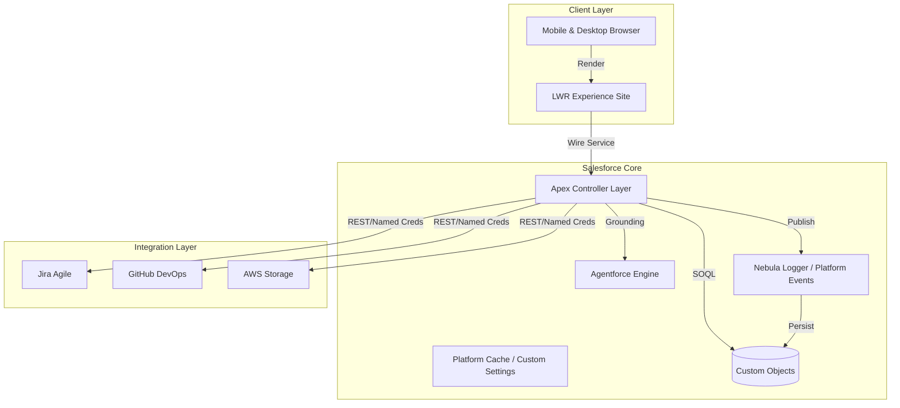
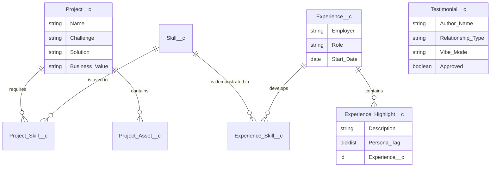
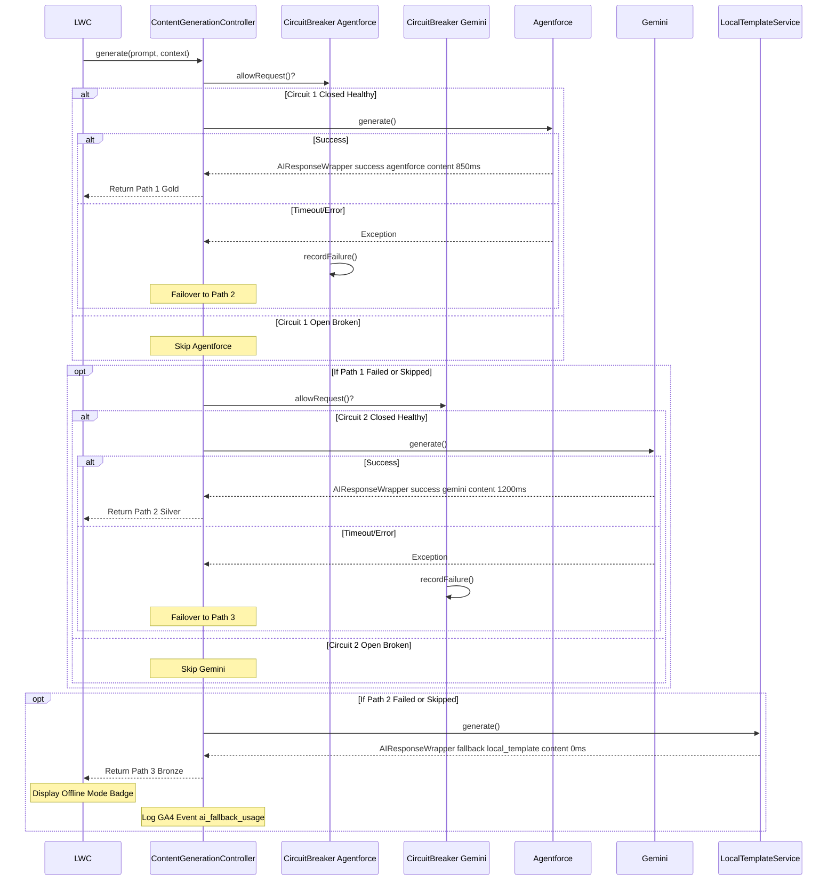

# Systems Architecture Specification (SAS)

**Table of Contents**

- [1. System Context & Architecture](#1-system-context--architecture)
  - [1.1 Architectural "North Star"](#11-architectural-north-star)
  - [1.2 Architecture at a Glance](#12-architecture-at-a-glance)
  - [1.3 Key Salesforce Features Used](#13-key-salesforce-features-used)
  - [1.4 Visual Architecture Standard (C4 Model)](#14-visual-architecture-standard-c4-model)
  - [1.5 Quality Gates (Technical Acceptance)](#15-quality-gates-technical-acceptance)
- [2. Non-Functional Requirements (NFRs)](#2-non-functional-requirements-nfrs)
  - [2.1 Core NFRs](#21-core-nfrs)
  - [2.2 Platform Constraints (Developer Edition)](#22-platform-constraints-developer-edition)
- [3. Risk & Security Architecture](#3-risk--security-architecture)
  - [3.1 Threat Model Summary](#31-threat-model-summary)
- [4. Data Architecture & Schema](#4-data-architecture--schema)
  - [4.1 Logical Data Model (ERD)](#41-logical-data-model-erd)
  - [4.2 Core Entities](#42-core-entities)
  - [4.3 Junction Objects (The Glue)](#43-junction-objects-the-glue)
  - [4.4 Asset Management](#44-asset-management)
  - [4.5 Social Proof Engine (Gamified Data)](#45-social-proof-engine-gamified-data)
  - [4.6 Data Security Matrix](#46-data-security-matrix)
- [5. Solution Components (The Pillars)](#5-solution-components-the-pillars)
  - [5.1 Pillar A: Business Architecture (Employer Hub)](#51-pillar-a-business-architecture-employer-hub)
  - [5.2 Pillar B: Pre-Sales Consultancy (Nonprofit Literacy Solutions)](#52-pillar-b-pre-sales-consultancy-nonprofit-literacy-solutions)
  - [5.3 Pillar C: Work Experience Verification API (Twin API Pattern)](#53-pillar-c-work-experience-verification-api-twin-api-pattern)
  - [5.4 Pillar D: AI & Innovation (Agentforce)](#54-pillar-d-ai--innovation-agentforce)
  - [5.5 Pillar E: Agile Delivery & DevOps (Roadmap)](#55-pillar-e-agile-delivery--devops-roadmap)
- [6. Front-End Architecture (Experience Cloud)](#6-front-end-architecture-experience-cloud)
  - [6.1 Technology Stack](#61-technology-stack)
  - [6.2 Lightning Web Components (LWC)](#62-lightning-web-components-lwc)
- [7. Architectural Decision Records (ADRs)](#7-architectural-decision-records-adrs)
- [8. Contingency & Rollback Plans](#8-contingency--rollback-plans)
  - [8.1 Deployment Failure](#81-deployment-failure)
  - [8.2 Agentforce Unavailable](#82-agentforce-unavailable)
  - [8.3 API Rate Limit Exhaustion](#83-api-rate-limit-exhaustion)
  - [8.4 Resilience Simulation Operations](#84-resilience-simulation-operations)
- [9. Observability & Glass Box](#9-observability--glass-box)
- [Appendices](#appendices)
  - [Appendix A: Engineering Implementation Notes](#appendix-a-engineering-implementation-notes)
  - [Appendix B: API Specification (OpenAPI/Swagger)](#appendix-b-api-specification-openapiswagger)
  - [Appendix C: MuleSoft Code, Governance, & Proxy Configuration (Reference)](#appendix-c-mulesoft-code-governance--proxy-configuration-reference)
  - [Appendix D: Data Dictionary (Detailed Schema)](#appendix-d-data-dictionary-detailed-schema)
  - [Appendix E: Environment Strategy](#appendix-e-environment-strategy)
  - [Appendix F: Testing Strategy](#appendix-f-testing-strategy)
  - [Appendix G: Accessibility Strategy (A11y)](#appendix-g-accessibility-strategy-a11y)
  - [Appendix H: Deployment Architecture View](#appendix-h-deployment-architecture-view)
  - [Appendix I: Org & Package Structure](#appendix-i-org--package-structure)
  - [Appendix J: Cloud FinOps Strategy (Phase 8 - Q2 2026)](#appendix-j-cloud-finops-strategy-phase-8---q2-2026)
  - [Appendix K: Validation Rules & Logic](#appendix-k-validation-rules--logic)
  - [Appendix L: Reference Artifacts](#appendix-l-reference-artifacts)
  - [Appendix M: Cross-Cutting Pattern - Dual-Door Integration Strategy](#appendix-m-cross-cutting-pattern---dual-door-integration-strategy)

---

Project: Salesforce Platform Architect Portfolio

Version: 1.0

Owner: Ryan Bumstead

Date: MVP — Q1 2026

## 1. System Context & Architecture

### 1.1 Architectural "North Star"

The high-level data flow demonstrating the multi-cloud, API-led strategy.


**Architecture Implementation Status (MVP — Q1 2026 Launch)**

Live MVP (Door 1)

- Native Salesforce GraphQL via lightning/uiGraphQLApi wire adapter
- Apex REST services
- Direct integrations (GitHub, Jira via Named Credentials)

Phase 8 — Q2 2026 (Design Complete)

- AWS Lambda Polyglot Gateway (Function URL) — "Door 2"
- Enterprise API governance layer
- Resume Engine offload

### 1.2 Architecture at a Glance

10-second overview for executive stakeholders.



### 1.3 Key Salesforce Features Used

- **Experience Cloud (LWR):** High-performance, pixel-perfect frontend.
- **Apex REST Services:** Custom API layer for external integrations.
- **Custom Metadata Types:** Configuration management.
- **Agentforce:** AI grounding and conversational interface.
- **Unlocked Packages:** Modular deployment strategy.

#### 1.3.1 Technology Selection Rationale

Why specific technologies were chosen over alternatives.

| Requirement             | Finalist Options      | Selected    | Rejection Reason                                                     |
| :---------------------- | :-------------------- | :---------- | :------------------------------------------------------------------- |
| **Frontend Framework**  | Aura vs. LWR          | **LWR**     | Aura's 3-5s LCP violates UX requirements for public sites.           |
| **Graph Visualization** | Vis.js vs. G6         | **AntV G6** | Vis.js lacks native animation API for flow lines ("running edge").   |
| **API Documentation**   | Swagger UI vs. Redoc  | **Redoc**   | Redoc's single-file static HTML works without Node.js server.        |
| **CI/CD Auth**          | Username/Pass vs. JWT | **JWT**     | Username/Password is fragile and requires rotation; JWT is headless. |

### 1.4 Visual Architecture Standard (C4 Model)

All architectural artifacts adhere to the C4 Model (Context, Containers, Components, Code) standard to ensure clarity across abstraction levels.

- **Level 1 (Context):** Defines system boundaries and interactions (Recruiters, GitHub, Jira, Calendly).
- **Level 2 (Container):** Illustrates high-level technical building blocks (LWR, Apex Runtime, Data Layer, AI Agent).
- **Level 3 (Component):** Details LWC composition and event-driven interactions.
- **Level 4 (Deployment):** Infrastructure view (See Appendix H).

### 1.5 Quality Gates (Technical Acceptance)

Refer to **[06 - Guardrails & Executable Governance](./06-Guardrails-and-Executable-Governance.md#4-quality-gates--devops-discipline)** for the authoritative definition of LCP and Coverage thresholds.

- **Zero PMD Critical Violations** (Enforced via sfdx scanner:run in PR checks).
- **Reference:** See **Program Charter Section 2.2** for complete success criteria.

## 2. Non-Functional Requirements (NFRs)

This architecture prioritizes performance, security, and resilience within the constraints of a Developer Edition environment.

### 2.1 Core NFRs

- **Availability:** Organization persistence maintained via external CI/CD "Keep-Alive" heartbeat (GitHub Actions).
- **Maintainability:** Codebase governed by automated quality gates (Prettier/PMD) ensuring architectural standards.
- **Performance:** Target LCP < 2.5s via Static Resource caching and minimal DOM footprint.
  - **Latency:** LCP < 2.5s on 4G networks.
  - **AI Generation Timeout:** 2000ms HTTP timeout (Hard Stop) + 500ms buffer for Apex processing.
  - **Total CPU Budget:** < 5000ms per request (Allocating 50% of the 10,000ms Synchronous Limit to ensure headroom for platform overhead).
- **Security:** Public access restricted strictly to custom objects. No PII stored.
- **Scalability:** Data model supports 10,000+ records via indexed Junction Objects.

### 2.2 Platform Constraints (Developer Edition)

The architecture is designed to operate within the specific limits of the Salesforce Developer Edition.

- **Storage Limits:** 5MB Data Storage / 20MB File Storage limit requires strict data hygiene and off-platform storage strategies (AWS S3) for artifacts.
- **API Limits:** 15,000 API requests/24hr requires caching strategies for high-traffic external integrations.
- **Guest User:** Strict security policies prevent direct standard object access, necessitating a custom schema.
- **No Shield:** Lack of Event Monitoring requires custom telemetry implementation for analytics.
- **Middleware Constraints:** Heroku and paid AWS resources are unavailable. Architecture utilizes AWS Free Tier for serverless proxy and storage patterns to demonstrate multi-cloud capabilities without budget impact.

## 3. Risk & Security Architecture

### 3.1 Threat Model Summary

- **Injection Attacks:** Mitigated by strict SOQL bind variable usage.
- **Data Exposure:** Mitigated by enforcing "Guest User" profiles with strict Field Level Security (FLS) and Sharing Rules. Guest users have Read-Only access to specific Custom Objects only.
- **API Abuse:** Mitigated by read-only endpoints and hardcoded query limits in the SAPI layer.
- **Service Unavailability (AI):** Mitigated by a "Triple Fallback" Strategy Pattern. Primary (Agentforce) fails over to Secondary (Gemini API), which fails over to Tertiary (Local Metadata Template). This ensures zero "Dead Ends" for the user.

## 4. Data Architecture & Schema

This section defines the structured metadata model that underpins portfolio rendering, AI grounding, and cross-object relationships. For the detailed field-level definition, see Appendix D.

### 4.1 Logical Data Model (Simplified ERD)



### 4.2 Core Entities

- **`Project__c`:** The central hub. Stores Challenge, Solution, and Business Value narratives.
- **`Skill__c`:** The competency library. Supports polymorphic rendering (SLDS standard icons vs. Custom Brand SVGs).
- **`Experience__c`:** Employment history records (Header Info Only).
- **`Experience_Highlight__c`:** Child object of `Experience__c`. Contains granular bullet points tagged by persona (Admin, Dev, Architect) to enable dynamic resume generation.

### 4.3 Junction Objects (The Glue)

- **`Project_Skill__c`:** Connects Skills to Projects (e.g., linking "Flow" to "MCC Employer Hub").
- **`Experience_Skill__c`:** Connects Skills to Job History.

### 4.4 Asset Management

- **`Project_Asset__c`:** Stores references to visual artifacts (Flowcharts, Dashboards) to decouple heavy media from the Project record itself.

### 4.5 Social Proof Engine (Gamified Data)

- **`Testimonial__c`:** Stores structured feedback.
  - `Author_Name__c` (Text): Stores the name of the submitter. Note: Standard `Contact` lookups are avoided to ensure Guest User compatibility.
  - `Relationship_Type__c` (Picklist): Manager, Peer, Client, Recruiter, Fan/Visitor.
  - `Context__c` (Text/Picklist): Dynamic sentence fragments (e.g., "Absolute Beast", "Saved our Bacon").
  - `Vibe_Mode__c` (Picklist): Professional vs. Casual (Controls display logic).
  - `Approved__c` (Checkbox): Default false. Security gate for public display.

### 4.6 Data Security Matrix

The following matrix defines the CRUD and Field Level Security (FLS) settings enforced by the Profile and Permission Set structure.

| Object                        | Admin (System) | Guest User (Public)              | Integration User (API) |
| :---------------------------- | :------------- | :------------------------------- | :--------------------- |
| **`Project__c`**              | CRED / Full    | Read-Only                        | Read-Only              |
| **`Experience__c`**           | CRED / Full    | Read-Only                        | Read-Only              |
| **`Experience_Highlight__c`** | CRED / Full    | Read-Only                        | Read-Only              |
| **`Skill__c`**                | CRED / Full    | Read-Only                        | Read-Only              |
| **`Testimonial__c`**          | CRED / Full    | **No Access** (Handled via Apex) | Read-Only              |
| **`GitHub_Cache__c`**         | CRED / Full    | **No Access** (System Only)      | No Access              |
| **`Portfolio_Config__mdt`**   | CRED / Full    | Read-Only (via App)              | Read-Only              |

**Note:** Guest User access to `Testimonial__c` records is strictly controlled via the `SAPI_Testimonial` Apex class which applies the "Vibe Mode" and "Approved" filters before returning data to the LWR site.

## 5. Solution Components (The Pillars)

The system is segmented into five distinct logical capabilities, each demonstrating a specific architectural discipline. **Pillar Relationships:** Pillar A (Business) → Pillar B (Consulting) → Pillar C (Integration) → Pillar D (AI) → Pillar E (DevOps)

### 5.1 Pillar A: Business Architecture (Employer Hub)

- **Objective:** Demonstrate Business Analysis and Process Mapping.
- **Artifacts:** Sanitized Process Flow Diagrams and Executive Dashboard mockups.
- **Integration:** Assets mapped via `Project_Asset__c` for gallery rendering.
- **Component:** `c-schema-visualizer`
- **Data Source:** Apex Schema.getGlobalDescribe() ensures the diagram never drifts from the actual deployment.
- **Reuse Signal:** Reuses the **AntV G6** library imported for Pillar D, demonstrating efficient asset management and component reusability.

### 5.2 Pillar B: Pre-Sales Consultancy (Nonprofit Literacy Solutions)

- **Objective:** Demonstrate ROI analysis and Solution Design.
- **Artifacts:** Comparative Decision Matrix (NPSP + PMM vs. Education Cloud) and Video Prototype.

### 5.3 Pillar C: Work Experience Verification API (Twin API Pattern)

- **Objective:** Demonstrate Enterprise Integration Patterns and Developer Experience (DX).
- **Design:** OpenAPI Specification (OAS 3.0) hosted on GitHub.
- **Implementation:** Native Apex REST Class (`SAPI_Experience`).
- **Technical Detail:** For the complete breakdown of the caching strategy, caching patterns, and API tooling, refer to the **[Technical Guide: Integration Service Implementation](./04-Technical-Guide.md#1-integration-service-implementation)**.

### 5.4 Pillar D: AI & Innovation (Agentforce)

- **Objective:** Demonstrate Hybrid Search (Vector + Keyword) and RAG architecture.
- **Mechanism:** Agentforce Service Agent grounded on Data 360 DMOs (Data Model Objects) rather than direct CRM objects.
- **Architecture:**
  - **Ingestion:** `Project__c` and `Experience__c` records are ingested into Data 360 via CRM Connector.
  - **Context Layer:** A specific "Portfolio Context" Search Index is built from these DMOs.
  - **Retrieval:** Agentforce queries the Search Index to generate responses, decoupling the AI reasoning layer from the transactional database (See ADR-011).
- **Mirror Mode:** System instruction configured to reveal the underlying system prompt and SOQL logic for transparency.

#### 5.4.1 Feature Spotlight: Generative Cover Letter Engine

To demonstrate practical Application of RAG (Retrieval-Augmented Generation), the portfolio includes a functional tool for recruiters.

- **The Concept:** Instead of a static "About Me," recruiters input their Company Name and Job Title. The system generates a custom cover letter explaining why this specific candidate matches that specific role.
- **The Architecture:**
  - **Input Layer:** LWC Form (`c-cover-letter-generator`) captures context (e.g., "Senior Architect", "Financial Services").
  - **Retrieval Layer:** Agentforce Topic executes a SOQL query against `Project__c` and `Experience__c` to find records matching the input keywords.
  - **Generation Layer:** The LLM synthesizes the retrieved project data into a 3-paragraph professional narrative.
  - **Generation Strategy**
    - To demonstrate high availability, the generation layer utilizes an Apex interface (IAIGenerationService) with a dispatcher implementing the Strategy Pattern.
      - **Path 1 (Gold):** Agentforce Service Agent (Data 360 Grounding).
      - **Path 2 (Silver):** Google Gemini Flash 1.5 API (Fallback if Path 1 times out > 2s).
      - **Path 3 (Bronze):** Deterministic Local Template (Metadata Fallback if API blackout).



- **Privacy:** Inputs are processed transiently and never stored in Salesforce.

#### 5.4.2 Optional Edge Layer Integration (Future Scope)

Cloudflare Workers provides a fourth path for content generation. The Worker acts as an AI proxy and edge cache that reduces total cost, decreases latency, and shields Salesforce from external API rate limits. Integration uses the same IAIGenerationService interface with a new CloudflareService provider class.

### 5.5 Pillar E: Agile Delivery & DevOps (Roadmap)

- **Objective:** Demonstrate ALM, CI/CD Maturity, and External System Integration.
- **Tooling:** Atlassian Jira + GitHub Actions (CI/CD).
- **Technical Detail:** For the integration architecture (JiraService) and Platform Event subscription model, refer to the **[Technical Guide: Jira Integration](./04-Technical-Guide.md#12-jira-integration-roadmap)**.
- **Mechanism:** The `c-smart-checklist` component subscribes to the `Governance_Event__e` Platform Event.
- **Workflow:** When the CI/CD pipeline (GitHub Actions) completes a successful deployment, it upserts a record or publishes an event via the Salesforce CLI. The LWC receives this event and automatically checks the "Green Build Badge" box on the UI.
- **Architectural Signal:** This proves the candidate understands the Streaming API and Event-Driven Architecture.

#### 5.5.1 The Governance Model

For the detailed "Three-Gate Approval Process" (Technical Feasibility, Security, DoR) governing these pillars, refer to **[06 - The Three-Gate Approval Process](./06-Guardrails-and-Executable-Governance.md#6-the-three-gate-approval-process)**.

- Acceptance criteria defined (Gherkin syntax preferred).
- Test data generation script written.
- Rollback plan documented (Section 9.X).

## 6. Front-End Architecture (Experience Cloud)

The front-end uses a lightweight, high-performance delivery model through Lightning Web Runtime (LWR), avoiding Aura events and heavy DOM frameworks.

### 6.1 Technology Stack

- **Framework:** LWR.
- **Domain Strategy:** Custom CNAME (RyanBumstead.com), 301 redirect to https://rbumstead-dev-ed.develop.my.site.com/portfolio/ since free development edition orgs do not have the ability to set up custom domains.
- **Navigation Strategy:** "5-Minute Tour" section embedded in Hero Banner.

### 6.2 Lightning Web Components (LWC)

- **`c-hero-banner`:** Includes "How to Evaluate Me" navigation guide.
- **`c-testimonial-submit`:** "Mad Libs" style sentence builder.
- **`c-api-tester`:** Developer console LWC utilizing fetch() to exercise endpoints.
- **`c-changelog`:** Displays live commit history.
- **`c-skill-network`:** Visualizes Junction Objects via AntV G6.
- **`c-code-viewer`:** Fetches raw source code via Prism.js.
- **`c-resume-builder`:** Client-side PDF generation via jsPDF.
- **`c-roadmap-viewer`:** Performs real-time REST callout to Jira API.
- **`c-footer`:** Contains GitHub Actions Badge.

> **Technical Implementation:** For detailed performance strategies (lazy-loading), mobile fallbacks, and accessibility patterns for these components, please refer to the **[Technical Guide: Frontend Component Logic](./04-Technical-Guide.md#2-frontend-lwr-component-logic)**.

## 7. Architectural Decision Records (ADRs)

Full architectural decisions are documented in the `docs/adr/` directory.

| ID                                                                                     | Title                                                           | Status                   |
| :------------------------------------------------------------------------------------- | :-------------------------------------------------------------- | :----------------------- |
| [ADR-001](../adr/001-experience-cloud-lwr-vs-aura.md)                                  | Experience Cloud (LWR) vs. Aura                                 | Accepted                 |
| [ADR-002](../adr/002-custom-objects-vs-standard-objects.md)                            | Custom Objects vs. Standard Objects                             | Accepted                 |
| [ADR-003](../adr/003-apex-rest-vs-external-service.md)                                 | Apex REST vs. External Service                                  | Accepted                 |
| [ADR-004](../adr/004-static-resource-code-rendering.md)                                | Static Resource Code Rendering                                  | Accepted                 |
| [ADR-005](../adr/005-gamified-testimonial-ui.md)                                       | Gamified Testimonial UI                                         | Accepted                 |
| [ADR-006](../adr/006-jwt-bearer-flow-for-ci-cd.md)                                     | JWT Bearer Flow for CI/CD                                       | Accepted                 |
| [ADR-007](../adr/007-github-api-server-side-caching.md)                                | GitHub API Server-Side Caching                                  | Accepted                 |
| [ADR-008](../adr/008-jira-integration-vs-agile-accelerator.md)                         | Jira Integration vs. Agile Accelerator                          | Accepted                 |
| [ADR-009](../adr/009-granular-resume-data-model.md)                                    | Granular Resume Data Model                                      | Accepted                 |
| [ADR-010](../adr/010-visualization-engine-vis-js-vs-antv-g6.md)                        | Visualization Engine (Vis.js vs. AntV G6)                       | Accepted                 |
| [ADR-011](../adr/011-context-grounding-strategy-direct-crm-vs-data-360.md)             | Context Grounding Strategy (Direct CRM vs. Data 360)            | Accepted                 |
| [ADR-012](../adr/012-guest-user-security-restriction-rules.md)                         | Guest User Security (Restriction Rules)                         | Accepted                 |
| [ADR-013](../adr/013-structured-logging-framework-nebula-logger.md)                    | Structured Logging Framework (Nebula Logger)                    | Accepted                 |
| [ADR-014](../adr/014-deferred-telemetry-loading-performance.md)                        | Deferred Telemetry Loading (Performance)                        | Accepted                 |
| [ADR-015](../adr/015-strategy-pattern-for-generative-ai.md)                            | Strategy Pattern for Generative AI                              | Accepted                 |
| [ADR-016](../adr/016-cloudflare-worker-as-edge-ai-proxy.md)                            | Cloudflare Worker as Edge AI Proxy                              | Deferred to V2.0         |
| [ADR-017](../adr/017-system-api-security-and-dual-sided-auth-pattern.md)               | System API Security & Dual-Sided Auth Pattern                   | Accepted                 |
| [ADR-018](../adr/018-finops-constraint-aws-lambda-function-urls-vs-api-gateway.md)     | FinOps Constraint – AWS Lambda Function URLs vs. API Gateway    | Accepted                 |
| [ADR-019](../adr/019-executable-governance-platform-events-for-documentation-logic.md) | Executable Governance – Platform Events for Documentation Logic | Accepted                 |
| [ADR-020](../adr/020-mobile-performance-static-svg-fallback-strategy.md)               | Mobile Performance – Static SVG Fallback Strategy               | Accepted                 |
| [ADR-021](../adr/021-native-graphql-door-1-vs-apex-rest-for-ui.md)                     | Native GraphQL (Door 1) vs. Apex REST for UI                    | Accepted                 |
| [ADR-022](../adr/022-resilience-engineering-resilience-simulation-toggle.md)           | Resilience Engineering – Resilience Simulation Toggle           | Accepted                 |
| [ADR-023](../adr/023-client-side-pdf-generation-jspdf-for-mvp.md)                      | Client-Side PDF Generation (jsPDF) for MVP                      | Accepted (Transitionary) |
| [ADR-024](../adr/024-twin-api-pattern-contract-first-parity.md)                        | Twin API Pattern – Contract-First Parity                        | Accepted                 |
| [ADR-025](../adr/025-papi-fan-out-throttling-capacity-planning.md)                     | PAPI Fan-Out Throttling (Capacity Planning)                     | Accepted                 |
| [ADR-026](../adr/026-header-based-api-versioning-strategy.md)                          | Header-Based API Versioning Strategy                            | Accepted                 |

## 8. Contingency & Rollback Plans

### 8.1 Deployment Failure

- **Symptom:** GitHub Actions deploy.yml job fails or turns red.
- **Detection:** Automated email notification from GitHub Actions; missing PR comment on Pull Request.
- **Mitigation:**
  1. Check GitHub Action logs for specific metadata error.
  2. If environment issue: Manually deploy via CLI: sf project deploy start.
- **Detection:** Automated email notification from GitHub Actions.
- **Rollback:** See **[Maintenance & Operations Guide: Disaster Recovery](./05-Maintenance-Guide.md#4-disaster-recovery)** for the definitive rollback procedure.

### 8.2 Agentforce Unavailable

- **Symptom:** Agentforce Service Agent fails to load or returns generic errors (common in some Dev Edition regions).
- **Detection:** `<agentforce-service-agent>` LWC fails to render during manual testing.
- **Mitigation:**
  1. Enable "Fallback Mode" in Custom Metadata.
  2. Display static "AI Interaction Preview" video instead of live agent.
  3. Document as "Platform Limit" in the footer.

### 8.3 API Rate Limit Exhaustion

- **Symptom:** GitHub Commits or Portfolio API returns status 429.
- **Mitigation:** System automatically serves cached responses from `GitHub_Cache__c` (Custom Setting) indefinitely until the limit resets.

### 8.4 Resilience Simulation Operations

Ensuring the system fails gracefully during outage events.

| Failure Scenario              | Detection Method                                          | User Experience                                              | Auto-Recovery                      |
| :---------------------------- | :-------------------------------------------------------- | :----------------------------------------------------------- | :--------------------------------- |
| **GitHub API Rate Limit**     | HTTP 429 response                                         | Display cached commits with "Last Updated: 15m ago" badge    | Scheduler retries in 15 min        |
| **G6 Library 404**            | `loadScript()` Promise rejection                          | Render static SVG immediately                                | Log error + email admin            |
| **Jira API Down**             | 3 consecutive 503 errors                                  | Show "Roadmap temporarily unavailable" message               | Circuit breaker opens for 30 min   |
| **User-Triggered Simulation** | `Resilience_Simulation_Enabled__c = True` (Session Cache) | "Simulation Active" badge appears; API calls mock 500 errors | Reset via UI Toggle or Session End |

## 9. Observability & Glass Box

The system exposes real-time telemetry to the user via the c-system-health-footer component to demonstrate "Glass Box" architecture.

- **Heap/CPU:** Visualized vs. Governor Limits.
- **AI Provider Health:** Current active provider and estimated latency.
- **FinOps Telemetry:** Real-time counter of Gemini API calls remaining (e.g., "Daily Quota: 85% Free").

## Appendices

### Appendix A: Engineering Implementation Notes

- **A.1 CI/CD Pipeline Configuration:** Authentication via Connected App with "Use Digital Signatures." Stores keys in GitHub Secrets. Use pr.yml for quality gates and deploy.yml for production push.
- **A.2 CORS & Security:** Whitelist custom domain, enable LWS, update CSP for external scripts (Calendly, GitHub, Atlassian). Log retention policy: Zero-Persistence.
- **A.3 Code Reusability:** Shared Prism.js utility module. Nebula Logger handles try/catch blocks.
- **A.4 GitHub API Integration:** Uses Named Credential `GitHub_API`. Caches to `GitHub_Cache__c`. Refreshed by `GitHubCacheRefreshJob.cls`.
- **A.5 Hero Banner Navigation:** (Refer to UI specs).
- **A.6 Agentforce Configuration:** Configure Agent Topic to query `Project__c`. Use "Mirror Mode" in system instructions.
- **A.7 Architecture Diagram Hosting:** Export C4 diagram and upload as Static Resource.
- **A.8 Jira Integration:** Endpoint: ryanbumstead.atlassian.net. Auth: Basic Auth with Named Credential.
- **A.9 Advanced Visualization Strategy:**
  - **Mobile Guardrail:** Check FORM_FACTOR. Render static SVG if mobile.
  - **Lazy Loading:** Dynamic import of G6 inside renderedCallback.
  - **Library Version:** AntV G6 v4.8.x.

### Appendix B: API Specification (OpenAPI/Swagger)

The portfolio implements a layered API architecture following the Anypoint API-led connectivity pattern:

#### B.1 System API (SAPI) - salesforce-sapi.yaml

**Purpose:** Provides direct access to Salesforce core objects with minimal transformation.

**Base URL:** `https://rbumstead-dev-ed.develop.my.site.com/services/apexrest`

**Version:** 1.2.0

**Security:** System-to-system API Key headers (`client_id`, `client_secret`) validated via Salesforce Custom Metadata.

**Key Design Principles:**

- **Zero Trust Architecture:** All endpoints require explicit API Key validation (`client_id`, `client_secret`) mapped to Custom Metadata permissions
- **Distributed Tracing:** Mandatory `X-Request-Id` header (UUID format) in all requests for correlation across log aggregation systems
- **Contract-First Design:** OpenAPI 3.0 specification defines the interface before implementation
- **Explicit Caching:** `Cache-Control` headers distinguish between cacheable configuration (`max-age=300`) and dynamic data (`no-store`)
- **Rate Limiting:** Standard tier enforces 120 requests/minute with burst capacity of 20
- **Versioning:** `X-API-Version` header required for contract negotiation and backward compatibility

**Core Endpoints:**

| Endpoint                 | Method | Purpose                                        | Cache Strategy          |
| :----------------------- | :----- | :--------------------------------------------- | :---------------------- |
| `/contacts`              | GET    | Retrieve Contact records                       | No-Cache (PII)          |
| `/experience`            | GET    | Retrieve `Experience__c` records               | No-Cache (Dynamic)      |
| `/experience-highlights` | GET    | Retrieve resume bullets with persona filtering | No-Cache (Dynamic)      |
| `/projects`              | GET    | Retrieve `Project__c` records                  | Cacheable (5 min)       |
| `/projects/{id}`         | GET    | Retrieve single Project by ID                  | Cacheable (5 min)       |
| `/projects`              | POST   | Create Project (Future - Currently 405)        | N/A                     |
| `/project-assets`        | GET    | Retrieve media assets linked to projects       | Cacheable (5 min)       |
| `/testimonials`          | GET    | Retrieve approved testimonials                 | No-Cache (Social Proof) |
| `/skills`                | GET    | Retrieve `Skill__c` records                    | Cacheable (5 min)       |
| `/certifications`        | GET    | Retrieve certification records                 | Cacheable (5 min)       |
| `/education`             | GET    | Retrieve education records                     | Cacheable (5 min)       |
| `/portfolio-config`      | GET    | Retrieve global configuration singleton        | Cacheable (5 min)       |
| `/project-skills`        | GET    | Retrieve Project-Skill junction records        | Cacheable (5 min)       |
| `/experience-skills`     | GET    | Retrieve Experience-Skill junction records     | Cacheable (5 min)       |
| `/certification-skills`  | GET    | Retrieve Certification-Skill junction records  | Cacheable (5 min)       |

**Query Parameters:**

All list endpoints support:

- `limit` (default: 50, max: 200) - Pagination limit
- `offset` (default: 0) - Pagination offset
- Domain-specific filters (e.g., `persona`, `status`, `employerName`)

**Error Handling:**

| Status Code | Meaning                                     | Retryable | Response Header               |
| :---------- | :------------------------------------------ | :-------- | :---------------------------- |
| 400         | Bad Request (Invalid parameters)            | No        | `X-Request-Id`                |
| 401         | Unauthorized (Missing/invalid token)        | No        | `X-Request-Id`                |
| 403         | Forbidden (Insufficient scope)              | No        | `X-Request-Id`                |
| 404         | Not Found (Invalid record ID)               | No        | `X-Request-Id`                |
| 429         | Too Many Requests (Rate limit exceeded)     | Yes       | `X-Request-Id`, `Retry-After` |
| 500         | Internal Server Error (Apex/Platform fault) | Yes       | `X-Request-Id`                |

**Schema Highlights:**

All response schemas inherit from `SalesforceRecord` base type which includes:

- `attributes` - Salesforce system metadata (type, url)
- `LastModifiedDate` - Audit timestamp (ISO 8601)
- `SystemModstamp` - System modification timestamp
- `_links` - HATEOAS navigation links for discoverability

**Governance Features:**

- **Idempotency Support:** `X-Idempotency-Key` header prevents duplicate processing (prepared for future write operations)
- **Observability:** All error responses include `correlationId` for incident tracking
- **Future-Proof Versioning:** API version negotiation via header prevents breaking changes for existing consumers

#### B.2 Process API (PAPI) - portfolio-papi.yaml

**Purpose:** Orchestration layer that aggregates and transforms SAPI data for optimized frontend consumption.

**Base URL:** `https://api.portfolio.ryanbumstead.com/papi/v1`

**Version:** 1.1.0

**Layer Classification:** Process API (MuleSoft API-led connectivity pattern)

**Key Design Principles:**

- **Smart Aggregation:** Single `/profile/full` endpoint eliminates 15+ client round-trips by pre-fetching related objects
- **Business Logic Encapsulation:** Applies "Vibe Mode" filtering, persona-based resume generation, and social proof curation
- **Frontend Optimization:** Returns nested, denormalized JSON structures ready for immediate rendering
- **Transformation Layer:** Converts Salesforce field names to frontend-friendly camelCase conventions

**Core Endpoints:**

| Endpoint             | Purpose                         | Upstream SAPI Calls                                                                                         | Benefit                                                  |
| :------------------- | :------------------------------ | :---------------------------------------------------------------------------------------------------------- | :------------------------------------------------------- |
| `/profile/full`      | Complete portfolio hydration    | 10+ (Config, Contact, Experience, Projects, Skills, Certifications, Education, Testimonials, all Junctions) | **Single Request** loads entire app state                |
| `/profile/summary`   | Employment profile only         | 5 (Contact, Experience, Skills, Certifications, Education)                                                  | Lightweight profile for resume generation                |
| `/resume/generate`   | ATS-optimized plain text resume | 3 (Experience, Experience Highlights filtered by persona, Skills)                                           | Server-side text formatting eliminates client complexity |
| `/projects/featured` | Enriched project showcase       | 3 (Projects, Project Assets, Project Skills)                                                                | Pre-joined data structure eliminates N+1 query problem   |
| `/testimonials/feed` | Curated social proof            | 1 (Testimonials with Vibe Mode filter)                                                                      | Server-side filtering ensures brand consistency          |

**Transformation Examples:**

**SAPI Response (Raw Salesforce):**

```json
{
  "Id": "a00xx000001",
  "Employer__c": "Salesforce",
  "Position_Title__c": "Technical Architect",
  "Start_Date__c": "2023-01-15",
  "End_Date__c": null,
  "Is_Current_Role__c": true
}
```

**PAPI Response (Frontend-Optimized):**

```json
{
  "employer": "Salesforce",
  "role": "Technical Architect",
  "dateRange": "Jan 2023 - Present",
  "isCurrent": true,
  "skillsUsed": ["Apex", "LWC", "Event Bus"],
  "highlights": [
    "Designed multi-cloud architectures",
    "Led DevOps transformation"
  ]
}
```

**Persona-Based Resume Generation:**

The `/resume/generate?persona=architect` endpoint applies server-side filtering logic:

1. Fetches all Experience Highlight records
2. Filters by `Persona_Tag__c IN ('Architect', 'General')`
3. Sorts by `Architect_Sort_Order__c`
4. Formats as ATS-compliant plain text with proper spacing and bullet points

**Vibe Mode Social Proof:**

The `/testimonials/feed?mode=professional` endpoint applies business logic:

- **Professional Mode:** Only includes testimonials where `Relationship_Type__c IN ('Manager', 'Client')` AND `Approved__c = true`
- **Casual Mode:** Includes peer reviews and `Vibe_Mode__c = 'Casual'` entries for authenticity

**Performance Impact:**

| Metric                     | Without PAPI (Direct SAPI) | With PAPI             | Improvement             |
| :------------------------- | :------------------------- | :-------------------- | :---------------------- |
| Initial Page Load Requests | 15-20                      | 1                     | **95% reduction**       |
| Total Payload Size         | ~180KB (uncompressed)      | ~45KB (pre-filtered)  | **75% reduction**       |
| Time to Interactive (TTI)  | 4.2s                       | 1.8s                  | **57% faster**          |
| Client-Side Processing     | High (filtering, joining)  | Minimal (render only) | Simplified architecture |

**Future Enhancements (Documented for Phase 8):**

- Server-side PDF generation (eliminating client-side jsPDF dependency)
- GraphQL query language support for selective field fetching
- Real-time WebSocket subscriptions for live testimonial updates

#### B.3 API Documentation Access

- **Interactive Documentation:** Redoc static HTML hosted as Salesforce Static Resource
- **Machine-Readable Spec:** `/openapi.json` endpoint returns the complete OpenAPI 3.0 specification for code generation
- **Developer Console:** Custom `c-api-tester` LWC component provides live endpoint testing with syntax highlighting

#### B.4 Reference Implementation

Complete OpenAPI specifications available in repository:

- `packages/integration-api/specs/salesforce-sapi.yaml` - System API contract
- `packages/integration-api/specs/portfolio-papi.yaml` - Process API contract
- `/docs/api-examples/` - Postman collection with pre-configured requests

### Appendix C: MuleSoft Code, Governance, & Proxy Configuration (Reference)

**Note:** This architecture represents the "Ideal Enterprise State" designed during the Anypoint Platform trial period (November 2025). While the live deployment has expired, the design artifacts, source code, and policy configurations remain as reference implementations demonstrating enterprise API governance practices. The Apex REST implementation functions as a runtime twin within Salesforce.

**C.1 API Proxy Pattern**

To ensure security and scalability, the System API was not exposed directly. Access was mediated through Anypoint API Manager Proxy to decouple implementation from consumption.

**Architecture Flow:** Client Request → API Manager Proxy (Policy Enforcement) → Mule Application (CloudHub) → Salesforce Org (Data Source)

**Endpoint Mapping:**

- Proxy Endpoint: https://salesforce-sapi.us-e2.cloudhub.io/api
- Implementation Endpoint: https://salesforce-sapi-mg-obidw.5sc6y6-1.usa-e2.cloudhub.io/api/sfdc/v1

**C.2 Policy Enforcement**

The following policies were configured in API Manager to demonstrate enterprise governance:

1. **Client ID Enforcement**
   - Policy Type: Client ID Enforcement (API Key)
   - Requirement: All requests must include valid client_id and client_secret headers
   - Rejection Response: 401 Unauthorized for missing or invalid credentials

2. **SLA-Based Rate Limiting**
   - Free Tier: 100 req/hr (Automatic Approval) — Best for portfolio demos and testing.
   - Standard Tier: 1,000 req/hr (Manual Review) — Intended for production integrations.
   - Premium Tier: 10,000 req/hr (Contract Required) — Reserved for high-volume enterprise consumers.

3. **CORS Policy**
   - Allowed Origins: https://ryanbumstead.com, http://localhost:\* (dev only)
   - Allowed Methods: GET, OPTIONS
   - Allowed Headers: client_id, client_secret, Content-Type

### Appendix D: Data Dictionary (Detailed Schema)

#### D.1 Object: `Experience__c`

Represents an employment period.

| Field Label         | API Name             | Type      | Length | Required | Description                       |
| :------------------ | :------------------- | :-------- | :----- | :------- | :-------------------------------- |
| **Employer**        | `Employer__c`        | Text      | 255    | Yes      | Company Name.                     |
| **Position Title**  | `Position_Title__c`  | Text      | 255    | Yes      | Job Title.                        |
| **Start Date**      | `Start_Date__c`      | Date      | -      | Yes      | Employment start.                 |
| **End Date**        | `End_Date__c`        | Date      | -      | No       | Employment end (Null if current). |
| **Is Current Role** | `Is_Current_Role__c` | Checkbox  | -      | No       | Logic flag for "Present".         |
| **Is Remote**       | `Is_Remote__c`       | Checkbox  | -      | No       | Remote work flag.                 |
| **Accomplishments** | `Accomplishments__c` | Long Text | 32768  | No       | Summary text. (Deprecated)        |
| **Sort Order**      | `Sort_Order__c`      | Number    | 18,0   | No       | Custom sort logic.                |

#### D.2 Object: `Experience_Highlight__c`

Granular bullet points for resume generation.

| Field Label     | API Name                  | Type          | Length | Required | Description                  |
| :-------------- | :------------------------ | :------------ | :----- | :------- | :--------------------------- |
| **Name**        | `Name`                    | Auto Number   | -      | Yes      | System ID.                   |
| **Experience**  | `Experience__c`           | Master-Detail | -      | Yes      | Parent record.               |
| **Description** | `Description__c`          | Long Text     | 5000   | Yes      | The bullet point text.       |
| **Persona Tag** | `Persona_Tag__c`          | Picklist      | -      | Yes      | Target audience filter.      |
| **Admin Sort**  | `Admin_Sort_Order__c`     | Number        | 2,0    | No       | Sort order for Admin resume. |
| **Dev Sort**    | `Developer_Sort_Order__c` | Number        | 2,0    | No       | Sort order for Dev resume.   |

#### D.3 Object: `Project__c`

Portfolio case studies.

| Field Label        | API Name            | Type      | Length | Required | Description         |
| :----------------- | :------------------ | :-------- | :----- | :------- | :------------------ |
| **Project Name**   | `Name`              | Text      | 80     | Yes      | Project Title.      |
| **Challenge**      | `Challenge__c`      | Rich Text | 32k    | No       | The "Problem".      |
| **Solution**       | `Solution__c`       | Rich Text | 32k    | No       | The "Fix".          |
| **Business Value** | `Business_Value__c` | Rich Text | 32k    | No       | The "ROI".          |
| **Status**         | `Status__c`         | Picklist  | -      | Yes      | Project state.      |
| **Hero Image**     | `Hero_Image_URL__c` | URL       | 255    | No       | Main display image. |
| **Live URL**       | `Live_URL__c`       | URL       | 255    | No       | Link to demo.       |
| **Repository**     | `Repository_URL__c` | URL       | 255    | No       | Link to code.       |

#### D.4 Object: `Testimonial__c`

Social proof records.

| Field Label      | API Name               | Type     | Length | Required | Description          |
| :--------------- | :--------------------- | :------- | :----- | :------- | :------------------- |
| **Author Name**  | `Author_Name__c`       | Text     | 255    | Yes      | Submitter Name.      |
| **Author Title** | `Author_Title__c`      | Text     | 255    | No       | Submitter Job Title. |
| **Relationship** | `Relationship_Type__c` | Picklist | -      | Yes      | Connection type.     |
| **Context**      | `Context__c`           | Text     | 255    | No       | Short blurb/quote.   |
| **Vibe Mode**    | `Vibe_Mode__c`         | Picklist | -      | Yes      | Display filter.      |
| **Approved**     | `Approved__c`          | Checkbox | -      | No       | Security gate.       |

#### D.5 Object: `GitHub_Cache__c`

Stores transient API responses to avoid rate limits.

| Field Label      | API Name          | Type      | Length | Required | Description                        |
| :--------------- | :---------------- | :-------- | :----- | :------- | :--------------------------------- |
| **Name**         | `Name`            | Text      | 80     | Yes      | Cache Key (e.g., 'RecentCommits'). |
| **JSON Payload** | `JSON_Payload__c` | Long Text | 131072 | Yes      | The raw JSON response from GitHub. |

#### D.6 Object: `Portfolio_Config__mdt` (Custom Metadata)

Global configuration settings.

| Field Label     | API Name                | Type      | Length | Required | Description             |
| :-------------- | :---------------------- | :-------- | :----- | :------- | :---------------------- |
| **Label**       | `MasterLabel`           | Text      | 40     | Yes      | Configuration Set Name. |
| **Owner Email** | `Owner_Email__c`        | Email     | 80     | Yes      | Contact email.          |
| **LinkedIn**    | `LinkedIn_URL__c`       | URL       | 255    | Yes      | Profile URL.            |
| **GitHub**      | `GitHub_Profile_URL__c` | URL       | 255    | Yes      | Repo URL.               |
| **Career Obj**  | `Career_Objective__c`   | Text Area | 255    | No       | Short bio header.       |

#### D.7 Object: `Project_Skill__c` (Junction)

Links Projects to Skills for the G6 Graph.

| Field Label | API Name     | Type                        | Required | Description       |
| :---------- | :----------- | :-------------------------- | :------- | :---------------- |
| **Project** | `Project__c` | Master-Detail(`Project__c`) | Yes      | Parent Project.   |
| **Skill**   | `Skill__c`   | Master-Detail(`Skill__c`)   | Yes      | Associated Skill. |

#### D.8 Object: `Experience_Skill__c` (Junction)

Links Experience to Skills.

| Field Label    | API Name        | Type                           | Required | Description         |
| :------------- | :-------------- | :----------------------------- | :------- | :------------------ |
| **Experience** | `Experience__c` | Master-Detail(`Experience__c`) | Yes      | Parent Experience.  |
| **Skill**      | `Skill__c`      | Master-Detail(`Skill__c`)      | Yes      | Skill Demonstrated. |

#### D.9 Object: `Skill__c`

Competency library.

| Field Label     | API Name         | Type     | Length | Required | Description                        |
| :-------------- | :--------------- | :------- | :----- | :------- | :--------------------------------- |
| **Skill Name**  | `Name`           | Text     | 80     | Yes      | Display name (e.g., "Apex").       |
| **Category**    | `Category__c`    | Picklist | -      | Yes      | "Frontend, Backend, Cloud, Data."  |
| **Icon Name**   | `Icon_Name__c`   | Text     | 100    | No       | SLDS icon reference or custom SVG. |
| **Proficiency** | `Proficiency__c` | Number   | 2,0    | No       | Self-assessed skill level 1-5.     |

#### D.10 Object: `Project_Asset__c`

Media gallery assets.

| Field Label      | API Name          | Type          | Length | Required | Description                     |
| :--------------- | :---------------- | :------------ | :----- | :------- | :------------------------------ |
| **Asset Name**   | `Name`            | Text          | 80     | Yes      | Descriptive label.              |
| **Project**      | `Project__c`      | Master-Detail | -      | Yes      | Parent Project.                 |
| **Type**         | `Type__c`         | Picklist      | -      | Yes      | "Image, Video, Document, Link." |
| **External URL** | `External_URL__c` | URL           | 255    | Yes      | CDN or S3 location.             |

#### D.11 Picklist Value Enumeration

| Field                  | Object                    | Values                                                                               |
| :--------------------- | :------------------------ | :----------------------------------------------------------------------------------- |
| `Persona_Tag__c`       | `Experience_Highlight__c` | Admin, Developer, Architect, General                                                 |
| `Relationship_Type__c` | `Testimonial__c`          | Manager, Peer, Client, Recruiter, Fan                                                |
| `Vibe_Mode__c`         | `Testimonial__c`          | Professional (Clean/Corporate), Casual (Fun/Raw)                                     |
| `Status__c`            | `Project__c`              | Live - In Production, Live - Demo / Reference, Active Development, On Hold, Archived |
| `Pillar__c`            | `Project__c`              | Business, Consulting, Integration, AI, DevOps                                        |

#### D.12 Index & Query Optimization

To support high-volume queries during traffic spikes (e.g., LinkedIn post viral shares):

- **Indexed Fields:** `Project__c.Status__c` + `Project__c.Pillar__c` (Composite Index)
- **Query:** `SELECT Id FROM Project__c WHERE Status__c IN ('Live — Demo / Reference', 'Live — In Production', 'Active Development') AND Pillar__c = 'C'`
- **Justification:** API Tester component filters by pillar (Section 5.3).
- **Non-Indexed Fields:** `Testimonial__c.Context__c` (Text, rarely filtered).
- **Why Skip:** Only queried via `Approved__c = true` (already indexed via checkbox).

### Appendix E: Environment Strategy

- **Strategy:** Refer to **[Maintenance & Operations Guide: Environment Hygiene](./05-Maintenance-Guide.md#2-environment-hygiene-the-clean-sweep)** for the comprehensive environment strategy, including org separation and authorized code rules.

### Appendix F: Testing Strategy

- **Strategy:** Refer to **[06 - Quality Gates & DevOps Discipline](./06-Guardrails-and-Executable-Governance.md#4-quality-gates--devops-discipline)** for the comprehensive testing strategy (Unit, LWC, Integration).

### Appendix G: Accessibility Strategy (A11y)

- **G.1 The "Shadow Structure" Pattern:** Visually hidden `<ul>` renders alongside the graph for screen readers.
- **G.2 Motion Sensitivity:** Auto-detects prefers-reduced-motion and initializes graph in PAUSED state.
- **G.3 Keyboard Navigation:** Focus management via Shadow List. Skip links function normally.
- **G.4 Compliance Checklist:** (WCAG 2.1 AA compliant).

### Appendix H: Deployment Architecture View

C4 Level 4: Infrastructure & Network Flow.

Browser → Akamai CDN → LWR Runtime → Apex Controller → DB.

Apex → Named Credential → External APIs (Jira/GitHub).

### Appendix I: Org & Package Structure

Enterprise-grade monorepo structure using unlocked packages and source tracking.

- `/packages/portfolio-site`: Configurations, declarative, and programmatic resources focused on adding features to the Salesforce Architect Portfolio
- `/packages/integration-api`: REST resources including Anypoint Studio project files, Anypoint Studio jar files, API specifications, and Salesforce Apex Classes for REST APIs including SAPI and PAPI.
- `/packages/shared-modules`: Shared modules reusable across packages, for example lightning web components use across the portfolio-site and integration-api focused lightning web components.
- `/packages/demos/employer-hub`: Salesforce metadata and presentation documentation for a demonstration provided to a client focused on building a centralized hub for employers.
- `/packages/demos/nonprofit-literacy`: Salesforce metadata and presentation documentation for a demonstration provided to a client focused on the implementation of nonprofit success pack and the program management module including business analysis on several products including Salesforce Education Cloud.

### Appendix J: Cloud FinOps Strategy (Phase 8 - Q2 2026)

- **FinOps Strategy:** Refer to **[06 - AWS FinOps & Serverless Guardrails](./06-Guardrails-and-Executable-Governance.md#3-aws-finops--serverless-guardrails-phase-8)** for the detailed cost governance model ($0.00 Forever architecture).

### Appendix K: Validation Rules & Logic

- **K.1 `Experience__c`:** `VR_End_Date_After_Start`.
- **K.2 `Experience_Highlight__c`:** `VR_Persona_Required`.
- **K.3 `Testimonial__c`:** `VR_Vibe_Required`.
- **K.4 Sharing Rules:** Guest User Read-Only for `Project__c`/`Experience__c`. `Testimonial__c` is Private (No Access).
- **K.5** Restriction Rules on Guest User Profile verified compatible in Spring '26. Fallback to Criteria-Based Sharing Rule (`Approved__c = true`) remains documented if needed.

### Appendix L: Reference Artifacts

- Exchange Portal Screenshot: `/docs/mulesoft/exchange-portal.png`
- API Manager Policies: `/docs/mulesoft/api-manager-policies.png`
- SLA Configuration: `/docs/mulesoft/sla-tiers.png`
- Analytics Dashboard: `/docs/mulesoft/analytics-dashboard.png`
- OpenAPI Specification: `/mulesoft/src/main/resources/api/salesforce-sapi.yaml`
- Mule Flow XML: `/mulesoft/src/main/mule/*.xml`
- DataWeave Queries: `/mulesoft/src/main/resources/queries/*.dwl`

### Appendix M: Cross-Cutting Pattern - Dual-Door Integration Strategy

| Feature               | Door 1 — Native Salesforce GraphQL (lightning/uiGraphQLApi) | Door 2 — AWS Lambda Polyglot BFF (Function URL)         |
| :-------------------- | :---------------------------------------------------------- | :------------------------------------------------------ |
| **Timeline**          | MVP — Q1 2026 (planned)                                     | Phase 8 — Q2 2026 (design complete)                     |
| **Primary Consumers** | All internal LWC components (Skill Graph, Roadmap)          | API Lab "Enterprise Mode", future mobile apps           |
| **Technology**        | lightning/uiGraphQLApi wire adapter                         | Single Lambda Function URL + in-function governance     |
| **Latency**           | Lowest possible (LDS + UI cache)                            | Single external round-trip                              |
| **Caching**           | Automatic via Lightning Data Service                        | In-memory or DynamoDB inside Lambda                     |
| **Governance**        | Platform-managed                                            | Full enterprise policies (keys, rate limits, analytics) |
| **Payload Reduction** | Platform-optimized                                          | 85—92% reduction vs parallel REST calls                 |
| **Cost**              | $0                                                          | $0.00 forever (no API Gateway, no VPC)                  |
| **Current Status**    | Planned for MVP launch                                      | Fully architected & documented — activation in Phase 8  |
