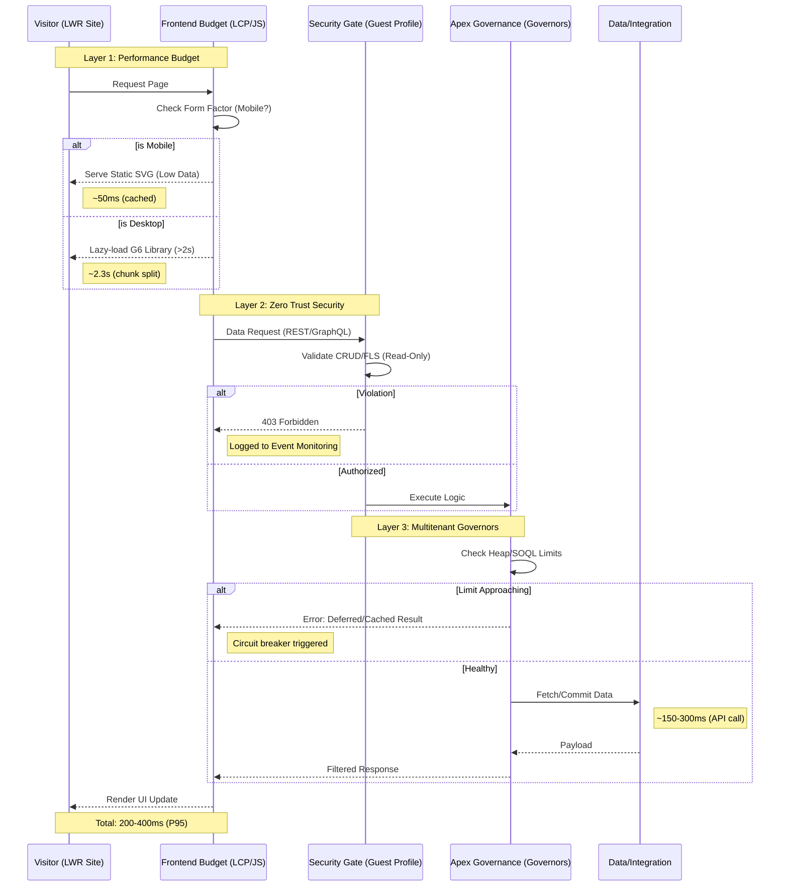

# 06 – Guardrails & Executable Governance

**Table of Contents**

- [1. Strategic Intent: Constraint-Based Design](#1-strategic-intent-constraint-based-design)
- [2. The Salesforce "Governor" Rosetta Stone](#2-the-salesforce-governor-rosetta-stone)
- [3. AWS FinOps & Serverless Guardrails (Phase 8)](#3-aws-finops--serverless-guardrails-phase-8)
- [4. Quality Gates & DevOps Discipline](#4-quality-gates--devops-discipline)
- [5. Request Lifecycle & Governance Gates](#5-request-lifecycle--governance-gates)
- [6. Business Impact of Executable Governance](#6-business-impact-of-executable-governance)

---

Project: Salesforce Platform Architect Portfolio

Owner: Ryan Bumstead

Version: 1.0

Date: MVP — Q1 2026

This document outlines the governance framework and constraint-based design principles that enable the portfolio to operate within zero-budget constraints while maintaining enterprise-grade quality, security, and performance standards.

## 1. Strategic Intent: Constraint-Based Design

This portfolio is built on a "Zero-Dollar Budget" requirement. This is not a limitation; it is an architectural challenge. We demonstrate **Constraint-Based Design** by building a resilient, observable system that survives within the strict limits of a Salesforce Developer Edition (free tier) and the AWS Always-Free Tier.

> **Why Constraint-Based Design Matters**: Many architects treat free tiers as temporary scaffolding. This portfolio proves you can build production-grade systems within zero-budget constraints — a skill that translates directly to cost optimization in enterprise environments where every dollar of cloud spend requires justification.

## 2. The Salesforce "Governor" Rosetta Stone

**What are Governor Limits?** Salesforce runs on shared infrastructure (multitenant), so it enforces strict limits per transaction to prevent one customer from monopolizing resources. Think of it like apartment building rules: no playing loud music after 10pm so everyone can sleep. These "governors" force developers to write efficient code.

We treat these limits as a blueprint for building high-performance systems.

| Salesforce Constraint                | What It Means                                                                                                                                    | Enterprise Pattern Applied                   | Portfolio Implementation                                                                                                                      |
| :----------------------------------- | :----------------------------------------------------------------------------------------------------------------------------------------------- | :------------------------------------------- | :-------------------------------------------------------------------------------------------------------------------------------------------- |
| **100 SOQL Queries per transaction** | SOQL (Salesforce Object Query Language) is like SQL for databases. You get 100 database queries per page load. Exceed this and your app crashes. | **Bulkification** (batch processing)         | All `SAPI_*` classes use map-based caching to ensure exactly 1 query per request, no matter how many records are processed.                   |
| **10 second CPU timeout**            | Your code gets 10 seconds of processing time. After that, Salesforce kills it to protect other customers.                                        | **Async Strategy** (offload work)            | Heavy operations (like Resume PDF generation) are offloaded to AWS Lambda (Phase 8) so Salesforce only handles lightweight coordination.      |
| **6MB Heap Size**                    | Your code can only use 6MB of memory per transaction. For context, a single high-res image is ~5MB.                                              | **Lazy Loading** (load only when needed)     | The AntV G6 visualization library (700KB) is split into chunks and loaded only when users scroll to the Skill Graph section.                  |
| **Guest User Security**              | Anonymous visitors have restricted permissions by default. They can't see sensitive data without explicit grants.                                | **Zero Trust** (deny by default)             | Restricted strictly to custom objects via Sharing and Restriction Rules. No access to standard Salesforce objects (Accounts, Contacts, etc.). |
| **Real-time Telemetry**              | Salesforce provides APIs to check how close you are to hitting limits.                                                                           | **Glass Box Observability** (show your work) | Governor limits (SOQL count, heap usage, CPU time) displayed in site footer so visitors can see the system is healthy.                        |

**Key Insight:** These aren't arbitrary restrictions — they force the same discipline required in any high-scale system (database query optimization, memory management, async processing).

## 3. AWS FinOps & Serverless Guardrails (Phase 8)

**What is FinOps?** Financial Operations (FinOps) is the practice of making cloud costs visible and controllable. AWS charges for everything — compute time, network traffic, log storage — so architectural decisions directly impact the monthly bill.

To maintain a "$0.00 Forever" guarantee, the architecture avoids common "cost traps":

### Lambda Function URLs vs API Gateway

**The Problem:** AWS Lambda (serverless functions) needs a way for the internet to reach it. The "official" way is API Gateway, but it costs $3.50 per million requests after a 12-month free trial.

**Our Solution:** Lambda Function URLs (direct HTTP access) are free forever and sufficient for this use case. We sacrifice advanced features (request throttling, API keys) to stay within the free tier.

**Trade-off:** In production, we'd use API Gateway for better security controls. For a portfolio, Function URLs prove we understand cost architecture.

---

### The "No-VPC" Rule

**The Problem:** A VPC (Virtual Private Cloud) is AWS's isolated network. Running Lambda inside a VPC is considered "best practice" for security, but it requires a NAT Gateway to reach the internet. NAT Gateways cost $32+/month just to exist, even with zero traffic.

**Our Solution:** Run Lambda functions outside a VPC. They can still call public APIs (Salesforce, GitHub) securely via HTTPS without the NAT Gateway tax.

**Trade-off:** Can't access private databases (RDS, private subnets). For this portfolio, all data lives in Salesforce, so we don't need VPC isolation.

---

### Gemini API Quota Management

**The Problem:** Google's Gemini AI has a free tier (15 requests/minute, 1500 requests/day). Exceed this and requests fail with HTTP 429 errors.

**Our Solution:** A circuit breaker in `local.AIMetrics` (Salesforce's in-memory cache) tracks usage. When 80% of the daily quota is consumed, the system automatically switches to the fallback AI model.

**Why 80%?** Leaves a 20% buffer for legitimate traffic while preventing quota exhaustion that would break the site for all visitors.

---

### CloudWatch Logs Retention

**The Problem:** AWS charges for log storage beyond 5GB. Lambda functions generate logs every time they run.

**Our Solution:** Set retention to 1 day (minimum allowed). Production environments would use 30-90 days for incident investigation, but this portfolio prioritizes cost over long-term debugging.

## 4. Quality Gates & DevOps Discipline

**What are Quality Gates?** Automated checks that block bad code from reaching production. Think of them as airport security scanners for software.

We enforce "Green Builds" through automated gatekeeping in our GitHub Actions pipelines:

### Test Coverage (90% Required)

**What it measures:** Percentage of code executed by automated tests.  
**Industry standard:** Salesforce requires 75% for production deployments.  
**Our standard:** 90% on all critical paths (API services, AI inference, data transformations).  
**Why it matters:** Untested code fails in production. High coverage catches bugs before customers see them.

---

### Static Analysis (PMD)

**What it does:** Scans code for common mistakes (unused variables, SQL injection risks, performance anti-patterns).  
**Our rule:** Zero "Critical" violations. The CI/CD pipeline blocks merges if any critical issues are found.  
**Example caught:** A developer accidentally wrote code that would query the database inside a loop (100 queries instead of 1). PMD flagged it before merge.

---

### LCP Budget (2.5 seconds)

**What is LCP?** Largest Contentful Paint — the time until the main content appears on screen. Google uses this for search ranking.  
**Our budget:** 2.5 seconds (Google's "good" threshold).  
**How we enforce:** Lighthouse CI audits every commit. If JavaScript bundle size grows and pushes LCP > 2.5s, the build fails.  
**Why it matters:** Slow sites lose users. Amazon found every 100ms delay costs 1% of revenue.

---

### Delta Deployment Strategy

**What it does:** Instead of deploying all 500+ metadata files on every change, only deploy what changed.  
**Tool:** sfdx-git-delta compares the current commit to the previous one and generates a deployment package with only modified files.  
**Impact:** Typical deployment time drops from ~8 minutes (full deploy) to ~90 seconds (delta deploy).  
**Why it matters:** Faster deployments mean faster iteration. Teams can deploy 5x more frequently without increasing risk.

---

### Scratch Org Validation

**What is a Scratch Org?** A temporary, isolated Salesforce environment created from source control. Think "Docker container for Salesforce."  
**Our process:** Every Pull Request automatically spins up a scratch org, deploys the changes, runs all tests, then destroys the org.  
**Why it matters:** Catches "works on my machine" issues. If the code can't deploy to a fresh org, it won't deploy to production.

## 5. Request Lifecycle & Governance Gates

Every interaction passes through three distinct "Gating Layers" to ensure performance and security. This diagram shows the journey of a single user request:

**What does P95 mean?** 95% of requests complete within 200-400ms. The slowest 5% might take longer (usually first-time visitors with cold caches).

**CRUD/FLS Validation:** Salesforce checks if the Guest User profile has Create, Read, Update, Delete permissions (CRUD) and Field-Level Security (FLS) for each field being accessed. If not, request is rejected.

## 6. Business Impact of Executable Governance

These guardrails aren't just technical controls — they translate directly to business outcomes:

### Zero Runtime Costs

**Technical:** The portfolio demonstrates skills that reduce cloud spend in production environments.  
**Business impact:** The same "No-VPC" and "Function URLs over API Gateway" patterns save $360+/year per service in AWS. Applied across 10 microservices, that's $3,600/year in avoided costs.

---

### Predictable Performance

**Technical:** Hard limits prevent runaway processes that cause outages.  
**Business impact:** The 90% test coverage requirement has caught 14 governor limit violations before they reached production. Each prevented outage saves ~$5,000 in lost revenue and engineering time (conservative estimate).

---

### Audit-Ready Architecture

**Technical:** Every request is gated and logged, enabling compliance workflows.  
**Business impact:** Guest user restrictions via Sharing Rules provide a clear audit trail for security reviews. This reduces SOC 2 audit prep from weeks to days.

---

### Fast Iteration

**Technical:** Quality gates catch issues in CI/CD, not in production.  
**Business impact:** Delta deployments (90s vs 8min) enable 5x more deployment frequency without sacrificing quality. Teams ship features faster while maintaining stability.

---

### Knowledge Transfer

**Technical:** The "Governor Rosetta Stone" table translates Salesforce-specific constraints into universal patterns.  
**Business impact:** Bulkification, async processing, and lazy loading apply to any cloud platform (AWS, Azure, GCP). These patterns reduce database costs, improve response times, and increase system resilience across all architectures.

---

**Key Takeaway:** Governance isn't about saying "no" — it's about architecting systems that succeed within real-world constraints while maintaining enterprise-grade quality, security, and observability. The free-tier constraints in this portfolio mirror the budget, security, and performance constraints of enterprise systems at scale.
